# Artificial Neural Network (ANN):
Example ANN structure. Also known as Feed Forward Networks or Multi Layer Perceptron (MLP)

## Layers
1. **Input Layer**
   - Neurons: 3  
   - Features: `x1`, `x2`, `x3`

2. **Hidden Layer 1**
   - Neurons: 4  
   - Activation: ReLU

3. **Hidden Layer 2**
   - Neurons: 3  
   - Activation: ReLU

4. **Output Layer**
   - Neurons: 1  
   - Activation: Sigmoid

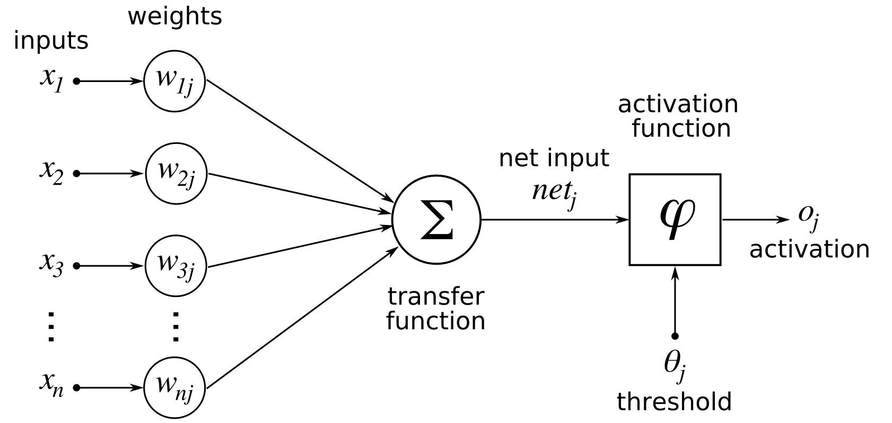

---

## Forward & Backward Propagation

### Forward Propagation

Forward propagation is the process of passing input data **left → right** through the network to produce a prediction. Each layer transforms its input with a weighted sum followed by an activation function.

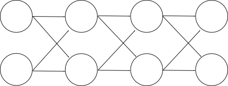

**Node-level view (scalar notation):**

For a single neuron `j`, the total input is the weighted sum of all incoming activations:

$$x_j = \sum_{i \in in(j)} w_{ij}\, y_i + b_j$$

Then the neuron fires its activation:

$$y_j = f(x_j)$$

where `in(j)` is the set of neurons feeding into `j`, `w_ij` is the weight on the edge from `i` to `j`, and `f` is a non-linear activation function (e.g. Sigmoid). This scalar form and the matrix form below describe the same operation — the matrix form just stacks all neurons in a layer at once.

---

**Step-by-step for a single neuron in layer l:**

1. Compute the weighted sum (pre-activation):
$$z^{[l]} = W^{[l]} \cdot a^{[l-1]} + b^{[l]}$$

2. Apply the activation function:
$$a^{[l]} = f\left(z^{[l]}\right)$$

3. Pass `a[l]` as input to the next layer.

This repeats layer by layer until the output layer produces the prediction **ŷ**.

**Computational graph — what gets stored:**

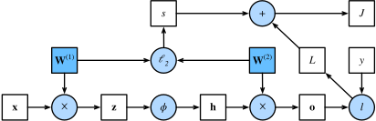

*Every intermediate value (z, a) computed during the forward pass is cached — backpropagation will need them to compute gradients.*

**Final output — compute the loss:**

| Task | Loss Function | Formula |
|---|---|---|
| Binary classification | Binary Cross-Entropy | $-[y \log\hat{y} + (1-y)\log(1-\hat{y})]$ |
| Multi-class | Cross-Entropy | $-\sum_k y_k \log \hat{y}_k$ |
| Regression | Mean Squared Error | $\frac{1}{n}\sum(y - \hat{y})^2$ |

---

### Backpropagation

Backpropagation computes the gradient of the loss with respect to every weight in the network by traversing it **right → left**, applying the chain rule at each layer.

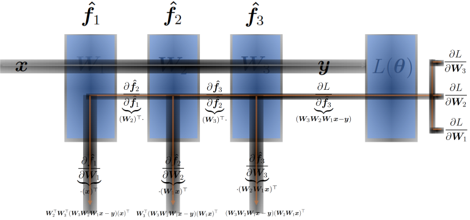

**The chain rule** lets us decompose the gradient layer by layer:

$$\frac{\partial L}{\partial W^{[l]}} = \frac{\partial L}{\partial a^{[l]}} \cdot \frac{\partial a^{[l]}}{\partial z^{[l]}} \cdot \frac{\partial z^{[l]}}{\partial W^{[l]}}$$

**Step-by-step (output → input):**

1. **Output layer** — compute error signal `δ`:
$$\delta^{[L]} = \frac{\partial L}{\partial z^{[L]}} = \frac{\partial L}{\partial \hat{y}} \cdot f'\!\left(z^{[L]}\right)$$

2. **Hidden layers** — propagate δ backward:
$$\delta^{[l]} = \left(W^{[l+1]T} \cdot \delta^{[l+1]}\right) \odot f'\!\left(z^{[l]}\right)$$

3. **Compute gradients** for weights and biases:
$$\frac{\partial L}{\partial W^{[l]}} = \delta^{[l]} \cdot a^{[l-1]T}, \qquad \frac{\partial L}{\partial b^{[l]}} = \delta^{[l]}$$

4. **Update weights** using gradient descent (learning rate η):
$$W^{[l]} \leftarrow W^{[l]} - \eta \cdot \frac{\partial L}{\partial W^{[l]}}$$

> **Why backprop is efficient:** It reuses the intermediate values cached during the forward pass. Each gradient is computed exactly once — no redundant recalculation regardless of network depth.

---

### Training Loop

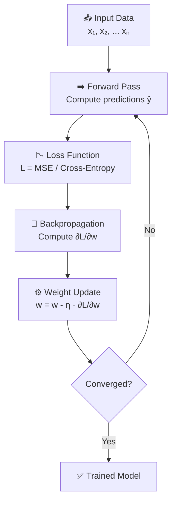

---

## Activation Functions

Activation functions introduce **non-linearity** into the network. Without them, stacking multiple layers would collapse into a single linear transformation — no matter how deep the network, it could only learn linear relationships.

Each neuron computes: `z = Σwᵢxᵢ + b`, then applies an activation: `a = f(z)`

---

### 1. Step Function (Historical)

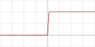

$$f(z) = \begin{cases} 0 & z < 0 \ 1 & z \geq 0 \end{cases}$$

| | |
|---|---|
| **Output range** | {0, 1} |
| **Gradient** | 0 everywhere (not differentiable at 0) |
| **Problem** | Cannot be used with backpropagation |
| **Used in** | Original perceptron (1958) — not used in modern ANNs |

---

### 2. Sigmoid (Logistic)

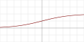

$$f(z) = \frac{1}{1 + e^{-z}}$$

| | |
|---|---|
| **Output range** | (0, 1) |
| **Gradient** | f'(z) = f(z)(1 - f(z)), max = 0.25 at z=0 |
| **Pros** | Smooth, differentiable; outputs interpretable as probabilities |
| **Cons** | **Vanishing gradient** — saturates at both ends; outputs not zero-centered |
| **Used in** | Binary classification **output layer** |

---

### 3. Tanh (Hyperbolic Tangent)

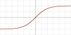

$$f(z) = \tanh(z) = \frac{e^z - e^{-z}}{e^z + e^{-z}}$$

| | |
|---|---|
| **Output range** | (-1, 1) |
| **Gradient** | f'(z) = 1 - tanh²(z), max = 1 at z=0 |
| **Pros** | Zero-centered — better gradient flow than sigmoid; stronger gradients |
| **Cons** | Still suffers from **vanishing gradient** at extreme values |
| **Used in** | Hidden layers in RNNs; older feedforward networks |

> **Tanh vs Sigmoid:** Tanh is almost always preferred over sigmoid for hidden layers — it's zero-centered, so gradients are less likely to all push in the same direction.

---

### 4. ReLU (Rectified Linear Unit)

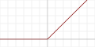

$$f(z) = \max(0, z)$$

| | |
|---|---|
| **Output range** | [0, ∞) |
| **Gradient** | 1 if z > 0, else 0 |
| **Pros** | No vanishing gradient for positive inputs; computationally cheap; sparse activations |
| **Cons** | **Dying ReLU** — neurons with z < 0 always output 0 and stop learning; not zero-centered |
| **Used in** | Default choice for **hidden layers** in CNNs and feedforward networks |

> **Most widely used activation function** in modern deep learning. Default unless there's a specific reason to use something else.

---

### 5. Leaky ReLU & PReLU

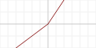

**Leaky ReLU** — α = 0.01 (fixed):

$$f(z) = \begin{cases} z & z > 0 \ 0.01z & z \leq 0 \end{cases}$$

**PReLU (Parametric ReLU)** — α is **learned** during training.

| | |
|---|---|
| **Output range** | (-∞, ∞) |
| **Pros** | Fixes dying ReLU — small gradient still flows for negative inputs |
| **Cons** | Extra hyperparameter; not always better than ReLU in practice |
| **Used in** | Hidden layers when dying ReLU is a problem |

---

### 6. ELU (Exponential Linear Unit)

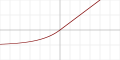

$$f(z) = \begin{cases} z & z > 0 \ \alpha(e^z - 1) & z \leq 0 \end{cases}$$

| | |
|---|---|
| **Output range** | (-α, ∞) |
| **Pros** | Smooth at z=0; mean activations closer to zero; no dying ReLU |
| **Cons** | More expensive than ReLU (exp for negative values) |
| **Used in** | Hidden layers when faster convergence is needed |

---

### 7. GELU (Gaussian Error Linear Unit)

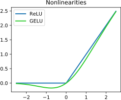

$$f(z) = z \cdot \Phi(z) \approx 0.5z\left(1 + \tanh\!\left[\sqrt{\frac{2}{\pi}}\left(z + 0.044715z^3\right)\right]\right)$$

where Φ(z) is the standard normal CDF.

| | |
|---|---|
| **Output range** | ≈ (-0.17, ∞) |
| **Pros** | Smooth, non-monotonic; weights inputs by their magnitude probabilistically |
| **Cons** | More expensive to compute |
| **Used in** | **BERT, GPT, and all modern Transformer-based models** |

---

### 8. Softmax

$$f(z_i) = \frac{e^{z_i}}{\sum_{j=1}^{K} e^{z_j}}$$

Softmax is applied to a **vector** of K scores, converting them into a probability distribution (all values sum to 1).

| | |
|---|---|
| **Output range** | (0, 1) per class, all sum to 1 |
| **Pros** | Interpretable class probabilities; differentiable |
| **Cons** | Sensitive to large inputs — use `log_softmax` in practice for numerical stability |
| **Used in** | **Multi-class classification output layer** exclusively |

---

### Summary Table

| Function | Range | Zero-centered | Vanishing Gradient | Dying Neurons | Typical Use |
|---|---|---|---|---|---|
| Step | {0,1} | No | N/A | Yes | Historical only |
| Sigmoid | (0,1) | No | Yes | No | Binary output layer |
| Tanh | (-1,1) | Yes | Yes (less severe) | No | RNN hidden layers |
| ReLU | [0,∞) | No | No (positive side) | Yes | Hidden layers (default) |
| Leaky ReLU | (-∞,∞) | No | No | No | Hidden layers |
| ELU | (-α,∞) | Approx | No | No | Hidden layers |
| GELU | ≈(-0.17,∞) | Approx | No | No | Transformers |
| Softmax | (0,1) | No | — | No | Multi-class output layer |

> **Rule of thumb:** Use **ReLU** (or **GELU** for transformers) in hidden layers. Use **Sigmoid** for binary output, **Softmax** for multi-class output.
