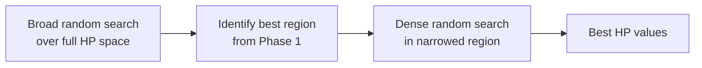
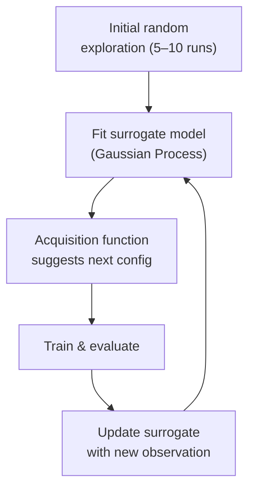

# Improving ANN Performance

---

## 1. Bias and Variance

Every trained model makes two kinds of errors. Understanding which one dominates tells you exactly what to fix.

### The Bias-Variance Trade-off

| Concept | What it means | Symptom |
|---|---|---|
| **Bias** | The model is too simple — it misses the true pattern even on training data | High training error |
| **Variance** | The model is too complex — it memorises training data but fails on new data | Low training error, high test error |
| **Irreducible error** | Noise in the data itself — cannot be reduced by any model | Floors both errors |

$$\text{Total Error} = \text{Bias}^2 + \text{Variance} + \text{Irreducible Noise}$$

---

### Diagnosing Your Model

```
               Train Error   |   Dev/Test Error   |   Diagnosis
         ──────────────────────────────────────────────────────
         High                |   High              |   High Bias (Underfitting)
         Low                 |   High              |   High Variance (Overfitting)
         High                |   Very High         |   Both Bias and Variance
         Low                 |   Low               |   Well-fitted ✓
```

> **Baseline:** Always compare against Bayes/human-level error. If humans get 1% error and your model gets 8% train / 10% test, you have both a bias problem (7% gap to human) and a variance problem (2% train-test gap).

---

### Fixing High Bias (Underfitting)

- Add more layers or neurons (increase model capacity)
- Train for more epochs
- Use a more powerful architecture
- Reduce regularization (if you over-regularized)
- Try a better optimization algorithm

### Fixing High Variance (Overfitting)

- Get more training data
- Apply **regularization** (L1, L2, Dropout — covered below)
- Use **early stopping**
- Reduce model complexity
- Use data augmentation

---

## 2. What is Regularization?

Regularization is any technique that **penalizes model complexity** to prevent overfitting. It adds a constraint that discourages the model from fitting noise in the training data.

The core idea: instead of minimizing just the loss, minimize loss **plus** a penalty for large/complex weights:

$$J_{\text{regularized}} = \underbrace{J(\theta)}_{\text{original loss}} + \underbrace{\lambda \cdot \Omega(\theta)}_{\text{complexity penalty}}$$

where:
- $J(\theta)$ is the standard loss (cross-entropy, MSE, etc.)
- $\Omega(\theta)$ is the **regularization term** (measures model complexity)
- $\lambda$ (lambda) is the **regularization strength** hyperparameter — controls the trade-off

---

## 3. Regularization Techniques

### 3.1 L2 Regularization (Weight Decay / Ridge)

Penalizes the **sum of squared weights**:

$$J_{\text{L2}} = J(\theta) + \frac{\lambda}{2} \sum_{l} \| W^{[l]} \|_F^2$$

where $\| W \|_F^2 = \sum_{i,j} w_{ij}^2$ is the Frobenius norm (sum of all squared weights in the layer).

**Effect on gradient update:**

$$W^{[l]} \leftarrow W^{[l]} - \eta \left(\frac{\partial J}{\partial W^{[l]}} + \lambda W^{[l]}\right) = \underbrace{\left(1 - \eta\lambda\right)}_{\text{decay factor}} W^{[l]} - \eta \frac{\partial J}{\partial W^{[l]}}$$

Each update **shrinks** every weight toward zero by a factor $(1 - \eta\lambda)$ before applying the gradient step — hence the name "weight decay."

| | |
|---|---|
| **Effect on weights** | Drives weights toward zero but rarely exactly zero |
| **Hyperparameter** | $\lambda$ — larger = stronger regularization |
| **Best for** | Most deep learning scenarios; default regularizer |
| **In Keras** | `kernel_regularizer=tf.keras.regularizers.l2(0.01)` |

---

### 3.2 L1 Regularization (Lasso)

Penalizes the **sum of absolute values** of weights:

$$J_{\text{L1}} = J(\theta) + \lambda \sum_{l} \| W^{[l]} \|_1 = J(\theta) + \lambda \sum_{l} \sum_{i,j} |w_{ij}|$$

**Effect on gradient:**

$$\frac{\partial}{\partial w} \left(\lambda |w|\right) = \lambda \cdot \text{sign}(w)$$

The gradient is a constant ±λ regardless of weight magnitude — this pushes small weights all the way to **exactly zero**, producing sparse networks.

| | |
|---|---|
| **Effect on weights** | Produces sparse solutions — many weights become exactly 0 |
| **Best for** | Feature selection; when you suspect many inputs are irrelevant |
| **Compared to L2** | L2 preferred for ANNs; L1 useful when sparsity is desired |

---

### 3.3 Elastic Net (L1 + L2)

Combines both penalties:

$$J_{\text{ElasticNet}} = J(\theta) + \lambda_1 \| W \|_1 + \lambda_2 \| W \|_F^2$$

Gets sparsity from L1 and stability from L2. Rarely used in deep learning directly but common in classical ML.

---

### 3.4 Dropout

Dropout randomly **deactivates** a fraction $p$ (the dropout rate) of neurons during each training forward pass.

**During training:**
- Each neuron is kept with probability $(1 - p)$, dropped with probability $p$
- Dropped neurons output 0 for that step — they don't contribute to forward or backward pass
- A different random subset is dropped each mini-batch

**During inference:**
- All neurons are active
- Outputs are **scaled down** by $(1 - p)$ to keep expected activation the same (inverted dropout)

$$a_{\text{train}} = \frac{r \odot a}{1-p}, \quad r_i \sim \text{Bernoulli}(1-p)$$

```
Without Dropout:                 With Dropout (p=0.5):
   o   o   o   o                    o   ☓   o   ☓
   |×| |×| |×| |×|                  |×|     |×|
   o   o   o   o                    o   ☓   ☓   o
```

| | |
|---|---|
| **Dropout rate** | Typically 0.2–0.5 for hidden layers; 0.5 is common |
| **Effect** | Forces the network to learn redundant representations — no single neuron can be relied on |
| **Best for** | Large networks where overfitting is a concern |
| **In Keras** | `tf.keras.layers.Dropout(rate=0.5)` |

> **Don't apply dropout on the output layer.** In practice, it's also often skipped on the first layer.

---

### 3.5 Summary: Which Regularizer to Use?

| Technique | Sparse weights? | Typical use |
|---|---|---|
| L2 (Weight Decay) | No — small but non-zero | Default for deep networks |
| L1 (Lasso) | Yes — many zeros | Feature selection |
| Elastic Net | Partial | Classical ML |
| Dropout | N/A (structural) | Large ANNs, CNNs |

---

## 4. Why Does Regularization Work? — The Intuition

### Intuition 1: Smaller Weights → Simpler Function

With L2 regularization, weights are penalized for being large. A network with large weights can represent sharp, complex, high-frequency decision boundaries. Forcing weights small constrains the network to learn **smoother, simpler functions** that generalize better.

$$\text{Large weights} \Rightarrow \text{steep activations} \Rightarrow \text{complex, wiggly boundary}$$
$$\text{Small weights} \Rightarrow \text{gentle activations} \Rightarrow \text{smooth, generalizable boundary}$$

Think of it geometrically: regularization shrinks the feasible region of the parameter space, keeping the optimal solution in a "simpler" zone.

### Intuition 2: Effective Network Capacity is Reduced

For sigmoid/tanh activations: when weights are forced small, $z = Wx + b$ is small, so activations stay in the **linear region** of the sigmoid/tanh (near zero). In that region, the activation is approximately linear. So a deep network with small weights behaves more like a shallow linear network — lower capacity, less prone to overfitting.

```
tanh(z) ≈ z  when z is small  →  effectively linear  →  simpler model
```

### Intuition 3: Dropout = Ensemble of Smaller Networks

With $n$ neurons and dropout rate $p$, each training step trains a different "thinned" sub-network. After training, the full network approximates the **geometric mean of all $2^n$ possible sub-networks** — an ensemble. Ensembles generalize better than any single model.

---

## 5. Early Stopping

Early stopping monitors a **held-out validation loss** during training and stops before the network overfits.


### How Training Loss vs. Validation Loss Evolve

```
Loss
 |
 |  \              ← training loss (keeps decreasing)
 |   \___
 |       \__  ↑   ← val loss (starts rising = overfitting begins)
 |          \/
 |           \___  ← ideal stopping point (N*)
 |_________________________ Epochs
```

### How to Implement

1. Split data into train / validation sets
2. After each epoch, compute validation loss
3. Track the **best** validation loss and save the corresponding weights
4. If validation loss does not improve for `patience` consecutive epochs → stop
5. Restore the weights from the best epoch

In Keras:
```python
from tensorflow.keras.callbacks import EarlyStopping, ModelCheckpoint

early_stop = EarlyStopping(
    monitor='val_loss',
    patience=10,         # epochs to wait before stopping
    restore_best_weights=True
)
```

| | |
|---|---|
| **Advantage** | Free — no extra hyperparameter to tune like λ |
| **Advantage** | Acts as regularizer AND reduces compute |
| **Risk** | Validation set must be representative; can be noisy |
| **Tip** | Use `patience` > 1 — single-epoch val loss spikes are common |

> Early stopping is effectively a form of regularization: it limits the number of gradient steps the model takes, which limits how much it can overfit.

---

## 6. Input Normalization (Feature Scaling)

### Why It Matters

Raw features often have very different scales (e.g., age ∈ [0, 100] vs. income ∈ [0, 1,000,000]). This creates an elongated, skewed loss surface where gradient descent struggles:

```
Without normalization:              With normalization:
  w₂                                  w₂
   |                                   |
   |  /  (very elongated              |   O  (circular —
   | /    loss contours)              |      fast convergence)
   |/_____ w₁                         |_____ w₁
```

Large-scale features dominate gradient updates, forcing you to use a tiny learning rate to avoid overshooting.

### Methods

#### 6.1 Min-Max Normalization (Rescaling)

Scales all features to $[0, 1]$:

$$x_{\text{norm}} = \frac{x - x_{\min}}{x_{\max} - x_{\min}}$$

| | |
|---|---|
| **Result** | All features in [0, 1] |
| **Problem** | Sensitive to outliers — one extreme value compresses everything else |
| **Use when** | Feature has a bounded, known range |

#### 6.2 Standardization (Z-score Normalization)

Transforms features to have **zero mean and unit variance**:

$$x_{\text{std}} = \frac{x - \mu}{\sigma}$$

where $\mu$ is the training set mean and $\sigma$ is the training set standard deviation.

| | |
|---|---|
| **Result** | Features centered at 0 with std = 1 |
| **Robust to outliers?** | More so than min-max |
| **Use when** | Default choice for most neural networks |

> **Critical rule:** Compute $\mu$ and $\sigma$ **only from the training set**. Apply the same values to validation and test sets. Never fit on test data — that's data leakage.

### Batch Normalization (Internal Covariate Shift)

Beyond input normalization, **Batch Normalization** normalizes the inputs to each hidden layer during training. For a mini-batch $\mathcal{B} = \{x_1, \ldots, x_m\}$:

$$\mu_\mathcal{B} = \frac{1}{m}\sum_{i=1}^m x_i, \quad \sigma^2_\mathcal{B} = \frac{1}{m}\sum_{i=1}^m (x_i - \mu_\mathcal{B})^2$$

$$\hat{x}_i = \frac{x_i - \mu_\mathcal{B}}{\sqrt{\sigma^2_\mathcal{B} + \epsilon}}$$

$$y_i = \gamma \hat{x}_i + \beta$$

where $\gamma$ (scale) and $\beta$ (shift) are **learnable parameters** — the network can learn to undo normalization if needed.

| | |
|---|---|
| **Effect** | Reduces internal covariate shift; allows higher learning rates |
| **Side effect** | Acts as mild regularizer (adds noise from batch statistics) |
| **Place in network** | Typically after linear transform, before activation |
| **In Keras** | `tf.keras.layers.BatchNormalization()` |

---

## 7. Vanishing and Exploding Gradients

In very deep networks, gradients are multiplied through many layers during backpropagation. This multiplication can cause gradients to **shrink exponentially** (vanishing) or **grow exponentially** (exploding).

### Why It Happens

In backpropagation, the gradient for layer $l$ is:

$$\frac{\partial L}{\partial W^{[l]}} = \delta^{[l]} \cdot a^{[l-1]T}$$

$$\delta^{[l]} = \left(W^{[l+1]T} \cdot \delta^{[l+1]}\right) \odot f'(z^{[l]})$$

Unrolling through $L$ layers:

$$\delta^{[1]} \propto \prod_{l=2}^{L} W^{[l]T} \cdot f'(z^{[l]})$$

- If weights are $< 1$ and $f'(z) < 1$ (e.g., sigmoid: max 0.25) → product **shrinks → vanishing**
- If weights are $> 1$ → product **explodes → exploding**

```
Vanishing gradient:   0.25 × 0.25 × 0.25 × 0.25 × 0.25 = 0.00098  (10 layers → ≈ 0)
Exploding gradient:   2.0  × 2.0  × 2.0  × 2.0  × 2.0  = 32       (grows fast)
```

| Symptom | Vanishing | Exploding |
|---|---|---|
| Training loss behavior | Stalls — early layers stop learning | Diverges — NaN loss |
| Gradient norms | Near zero for early layers | Very large / NaN |
| Typical cause | Sigmoid/Tanh + deep network | Poor weight init + deep network |

---

### Solutions

#### 7.1 Better Activation Functions — Use ReLU

Sigmoid saturates: $f'(z) \leq 0.25$ always. For a 10-layer sigmoid network, the gradient is multiplied by at most $0.25^{10} \approx 10^{-6}$ — essentially zero.

**ReLU** has gradient = 1 for all positive inputs. No squashing in the positive region → gradients flow cleanly.

$$f'_{\text{ReLU}}(z) = \begin{cases} 1 & z > 0 \\ 0 & z \leq 0 \end{cases}$$

> **Rule:** Use ReLU (or Leaky ReLU / ELU / GELU) in hidden layers of deep networks. Avoid sigmoid/tanh in hidden layers unless you have a specific reason.

---

#### 7.2 Proper Weight Initialization

If weights start too large or too small, activations saturate or vanish even before training begins. The goal: keep the **variance of activations and gradients approximately constant** across layers.

**Xavier / Glorot Initialization** (for Sigmoid / Tanh):

$$W \sim \mathcal{U}\!\left[-\sqrt{\frac{6}{n_{\text{in}} + n_{\text{out}}}},\ \sqrt{\frac{6}{n_{\text{in}} + n_{\text{out}}}}\right]$$

or equivalently, from a normal distribution with:

$$\text{Var}(W) = \frac{2}{n_{\text{in}} + n_{\text{out}}}$$

**He Initialization** (for ReLU and its variants):

$$W \sim \mathcal{N}\!\left(0,\ \sqrt{\frac{2}{n_{\text{in}}}}\right)$$

The $\sqrt{2/n_{\text{in}}}$ factor accounts for the fact that ReLU zeroes out half the neurons on average.

| Activation | Recommended Initialization |
|---|---|
| Sigmoid / Tanh | Xavier / Glorot |
| ReLU / Leaky ReLU | He (Kaiming) |
| SELU | LeCun |

In Keras:
```python
tf.keras.layers.Dense(128, activation='relu',
                       kernel_initializer='he_normal')
```

---

#### 7.3 Gradient Clipping (for Exploding Gradients)

Clip gradients to a maximum norm before the weight update. This prevents any single gradient step from being catastrophically large.

**By norm:**

$$\text{if } \|\nabla\| > \text{threshold}: \quad \nabla \leftarrow \frac{\text{threshold}}{\|\nabla\|} \cdot \nabla$$

**By value:** clip each gradient element to $[-c, c]$.

```python
optimizer = tf.keras.optimizers.Adam(clipnorm=1.0)
# or
optimizer = tf.keras.optimizers.Adam(clipvalue=0.5)
```

> Clipping by **norm** is preferred — it preserves the direction of the gradient update and just reduces its magnitude.

---

#### 7.4 Batch Normalization

By normalizing activations at each layer, batch norm ensures inputs to each layer stay in a healthy range — preventing saturated activations and stabilizing gradient magnitudes throughout the network.

This is arguably the single most impactful technique for training very deep networks:
- Allows **much higher learning rates**
- Reduces sensitivity to weight initialization
- Acts as a mild regularizer

---

#### 7.5 Residual Connections (Skip Connections)

Used in **ResNets** — instead of learning $F(x)$, a layer learns the **residual** $F(x) = H(x) - x$, and the final output is $H(x) = F(x) + x$:

$$a^{[l+2]} = F(a^{[l]}, W^{[l]}, W^{[l+1]}) + a^{[l]}$$

The $+a^{[l]}$ skip connection provides a **direct gradient highway** from deep layers back to shallow ones — gradients bypass the intermediate layers and reach early layers without shrinking.

```
  a[l] ────────────────────────────────────────┐
    │                                           │ (identity shortcut)
    ▼                                           │
  [Linear → BN → ReLU → Linear → BN] ──F(x)──► (+) ──► ReLU ──► a[l+2]
```

> Residual connections are why networks like ResNet-152 (152 layers) can be trained at all. Without them, gradients vanish completely before reaching the first layer.

---

### Summary: Fixes for Vanishing / Exploding Gradients

| Problem | Fix |
|---|---|
| Vanishing (sigmoid/tanh) | Switch to ReLU / Leaky ReLU |
| Vanishing (poor init) | Use He or Xavier initialization |
| Vanishing (very deep) | Add residual / skip connections |
| Vanishing + covariate shift | Add Batch Normalization |
| Exploding gradients | Gradient clipping (`clipnorm`) |
| Exploding (poor init) | Use proper initialization |

---

## 8. Hyperparameter Tuning

A hyperparameter is any value you set **before** training begins — it is not learned by gradient descent. Choosing good hyperparameters is often the difference between a model that converges and one that doesn't.

---

### 8.1 The Hyperparameter Landscape

| Hyperparameter | Typical Range | Priority |
|---|---|---|
| Learning rate $\alpha$ | $10^{-5}$ – $10^{-1}$ | **Highest** — most impactful single HP |
| Batch size | 16 – 512 | High |
| Number of hidden layers | 1 – 10+ | High |
| Units per layer | 32 – 1024 | Medium |
| Dropout rate | 0.1 – 0.5 | Medium |
| L2 regularization $\lambda$ | $10^{-5}$ – $10^{-1}$ | Medium |
| Momentum $\beta$ / Adam $\beta_1, \beta_2$ | 0.85–0.99 / 0.9, 0.999 | Low — defaults usually fine |
| Weight initialization scheme | He / Xavier | Low — set once, forget |

> **Rule of thumb:** Tune in priority order. Nail the learning rate first. A bad learning rate will make every other tuning effort pointless.

---

### 8.2 Searching on the Right Scale

Many hyperparameters should be searched on a **logarithmic scale**, not a linear one.

**Why:** The effect of changing $\alpha$ from 0.001 to 0.002 is enormous (doubles it). Changing from 0.9 to 0.901 is negligible. Equal spacing in log-space gives equal *relative* changes.

```python
# Linear scale — bad for learning rate
alpha = [0.0001, 0.0002, 0.0003, ..., 0.001]  # wastes most budget near 0

# Log scale — correct
import numpy as np
alpha = 10 ** np.random.uniform(-5, -1)  # samples uniformly from [1e-5, 1e-1]
```

| Hyperparameter | Scale to search |
|---|---|
| Learning rate $\alpha$ | Log: $10^{-5}$ to $10^{-1}$ |
| Regularization $\lambda$ | Log: $10^{-5}$ to $10^{-1}$ |
| Momentum $\beta$ | Log on $(1-\beta)$: search $(1-\beta)$ in $[0.001, 0.1]$ |
| Batch size | Powers of 2: 16, 32, 64, 128, 256 |
| Number of layers / units | Linear or powers of 2 |

For momentum: searching $\beta \in [0.9, 0.999]$ linearly is misleading. $\beta = 0.9$ means a window of ~10 steps; $\beta = 0.999$ means ~1000 steps — a 100× difference. Search $(1 - \beta)$ on a log scale instead.

---

### 8.3 Strategy 1: Manual / Hand Tuning

The simplest approach: adjust one hyperparameter at a time based on intuition and observation.

**Process:**
1. Start with known good defaults (Adam with $\alpha=0.001$, batch=32)
2. Train, observe loss curves
3. If loss diverges → $\alpha$ too high; if barely moves → $\alpha$ too low
4. Adjust and repeat

**When to use:** Early exploration, when compute is limited, or when you have strong domain knowledge.

**Weakness:** Slow, not reproducible, misses interactions between hyperparameters.

---

### 8.4 Strategy 2: Grid Search

Exhaustively evaluate every combination of a discrete set of values.

```
Learning rates: [0.1, 0.01, 0.001]
Batch sizes:    [32, 64, 128]
→ 3 × 3 = 9 experiments
```


| | |
|---|---|
| **Pros** | Simple; fully reproducible; covers all combinations |
| **Cons** | Scales exponentially — 5 HPs × 5 values each = $5^5 = 3125$ runs |
| **Use when** | Few HPs, cheap model, small search space |

**The curse of dimensionality:** Adding one more hyperparameter multiplies the total runs by the number of values. Grid search becomes infeasible fast.

---

### 8.5 Strategy 3: Random Search

Sample hyperparameter values **randomly** from defined distributions rather than a fixed grid.

```python
for _ in range(n_trials):
    alpha = 10 ** np.random.uniform(-4, -1)
    batch = np.random.choice([32, 64, 128, 256])
    dropout = np.random.uniform(0.1, 0.5)
    # train and evaluate
```

**Why random search beats grid search** (Bergstra & Bengio, 2012): In practice, only a few HPs matter for a given problem. Grid search wastes evaluations: if learning rate is the only important HP, a 3×3 grid tests only 3 distinct learning rates. A random search of 9 runs tests 9 distinct learning rates.

```
Grid search (3×3):          Random search (9 runs):
  lr: 3 distinct values       lr: 9 distinct values
  batch: 3 distinct values    batch: 9 distinct values
  → redundant coverage        → better coverage of important HPs
```

| | |
|---|---|
| **Pros** | Much more efficient than grid; easy to implement; parallelizable |
| **Cons** | No guarantee of finding optimum; purely stochastic |
| **Use when** | Medium-large HP spaces, moderate compute budget |
| **Budget** | 20–100 random trials covers most practical HP spaces well |

---

### 8.6 Strategy 4: Coarse-to-Fine Search

A two-phase refinement strategy that combines the breadth of random search with focused exploitation.

**Phase 1 — Coarse search:** Broad random search over the full range.

```
Learning rate: [1e-5, 1e-1]  →  finds promising region around [1e-3, 1e-2]
```

**Phase 2 — Fine search:** Zoom in and search densely within the promising region.

```
Learning rate: [5e-4, 5e-3]  →  precise optimum found
```



This is a practical default strategy for most teams — simple to implement and highly effective.

---

### 8.7 Strategy 5: Bayesian Optimization

Builds a **probabilistic surrogate model** (typically a Gaussian Process) of the validation loss as a function of hyperparameters. Uses this model to intelligently pick the next HP combination to try — balancing **exploration** (uncertain regions) and **exploitation** (promising regions).

**How it works:**

1. Run a few random initial trials
2. Fit a surrogate model to (HP config → validation loss) observations
3. Use an **acquisition function** (e.g., Expected Improvement) to select the next config most likely to improve
4. Train, observe, update the surrogate
5. Repeat



| | |
|---|---|
| **Pros** | Finds good HPs with far fewer runs than random/grid; learns from past trials |
| **Cons** | Overhead of surrogate model; scales poorly to >20 HPs; sequential by default |
| **Use when** | Each training run is expensive (large model, long training) |
| **Libraries** | `optuna`, `scikit-optimize`, `hyperopt`, `wandb sweeps` |

```python
import optuna

def objective(trial):
    alpha = trial.suggest_float('alpha', 1e-5, 1e-1, log=True)
    dropout = trial.suggest_float('dropout', 0.1, 0.5)
    # build and train model, return val_loss
    return val_loss

study = optuna.create_study(direction='minimize')
study.optimize(objective, n_trials=50)
print(study.best_params)
```

---

### 8.8 Strategy 6: Learning Rate Finder

A fast, practical technique to identify a good learning rate range **before** committing to a full training run (Leslie Smith, 2015).

**Algorithm:**
1. Start with a very small learning rate (e.g., $10^{-7}$)
2. Train for a mini-batch, record the loss
3. Multiply the learning rate by a small factor (e.g., 1.3×)
4. Repeat until loss diverges

**Reading the curve:**

```
Loss
 │
 │          ╲
 │           ╲___
 │                ╲___
 │                    ╲__
 │                        ╲____   ← diverges here
 └──────────────────────────────── Learning Rate (log scale)
       ↑           ↑
    too slow    sweet spot
               (steepest descent)
```

Pick the learning rate at the **steepest descent** point (not the minimum — that's already too high).

```python
# PyTorch Lightning has this built-in
trainer.tune(model)  # runs LR finder automatically

# In PyTorch manually:
from torch.optim.lr_scheduler import OneCycleLR
```

---

### 8.9 Strategy 7: Population-Based Training (PBT)

Combines random search with online adaptation. Runs a population of models **in parallel**, periodically copying weights from better-performing models into worse ones and mutating their hyperparameters.

Unlike other strategies where HPs are fixed for the whole run, PBT **adapts HPs during training** — e.g., starting with a high learning rate and annealing it based on what the population learns.

Used by DeepMind for training game-playing agents and large language models.

| | |
|---|---|
| **Pros** | Finds HP schedules, not just static HP values; very sample-efficient |
| **Cons** | Complex to implement; requires many parallel training runs |
| **Use when** | Very large-scale training with significant compute budget |

---

### 8.10 Best Practices

**Train/val/test discipline:**

Never tune hyperparameters on the test set. The test set is for final unbiased evaluation only. Use a separate validation set (or k-fold CV for small datasets) for all HP decisions.

```
Train set   → gradient updates (learning)
Val set     → HP tuning (model selection)
Test set    → final performance report (untouched until the end)
```

**Babysitting vs. parallel search:**

| Approach | Description | When to use |
|---|---|---|
| **Babysitting (Panda)** | One model, watch and adjust manually | Limited compute, large model |
| **Parallel search (Caviar)** | Many models simultaneously, pick the best | Plenty of compute, smaller model |

**Practical defaults to start from:**

| Hyperparameter | Default starting point |
|---|---|
| Optimizer | Adam |
| Learning rate | 1e-3 |
| Batch size | 32 or 64 |
| Hidden layers | 2–3 |
| Units per layer | 128 or 256 |
| Dropout | 0.3 |
| Weight init | He (ReLU), Xavier (sigmoid/tanh) |

**Log everything.** Use tools like Weights & Biases (`wandb`) or MLflow to track every experiment — HP config, train/val curves, final metrics. Without logging, you'll repeat experiments you already ran.

---

### 8.11 Strategy Comparison

| Strategy | Sample Efficiency | Parallelizable | Implementation | Best For |
|---|---|---|---|---|
| Manual tuning | Low | — | Trivial | Initial exploration |
| Grid search | Low | Yes | Easy | Small HP spaces (≤3 HPs) |
| Random search | Medium | Yes | Easy | Most practical cases |
| Coarse-to-fine | Medium-High | Yes | Easy | Standard best practice |
| Bayesian optimization | High | Partial | Moderate | Expensive training runs |
| LR Finder | N/A | N/A | Easy | Learning rate only |
| Population-based | Very High | Requires many GPUs | Complex | Large-scale training |

---

## Complete Checklist: Improving ANN Performance

```
Problem              Diagnosis                      Fix
──────────────────────────────────────────────────────────────────────
High bias            Train error >> target          Bigger model, more epochs
High variance        Train << Test error            Regularization, more data, dropout
Slow convergence     Loss barely moves              Normalize inputs, better LR schedule
Exploding gradients  NaN loss, huge gradients       Clip gradients, He init
Vanishing gradients  Early layers don't learn       ReLU, BN, skip connections, He init
Overfitting          Val loss rising                L2 reg, dropout, early stopping
```
