# Optimization Algorithms

Optimization algorithms are the engine of neural network training. They determine **how** we update the weights to minimize the loss function. The choice of optimizer directly affects convergence speed, stability, and the quality of the final model.

---

## The Optimization Problem

Training a neural network reduces to finding weights **W** and biases **b** that minimize a loss function $J(W, b)$ over the training set:

$$W^*, b^* = \arg\min_{W,b} J(W, b)$$

The loss landscape is a high-dimensional surface. Gradient descent and its variants navigate this surface by following the (negative) gradient downhill toward a minimum.

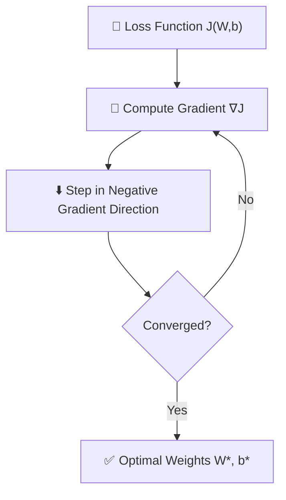

> **Key insight:** The gradient $\nabla J$ points in the direction of **steepest ascent**. We step in the **opposite** direction to descend. The step size is controlled by the **learning rate** $\alpha$.

---

### The Gradient Descent Family

All optimizers discussed here are variants of gradient descent. They differ in:

1. **How many samples** they use to compute the gradient (batch vs. mini-batch vs. single sample)
2. **Whether they accumulate history** (momentum, adaptive methods)
3. **Whether the learning rate adapts** per parameter (RMSProp, Adam)

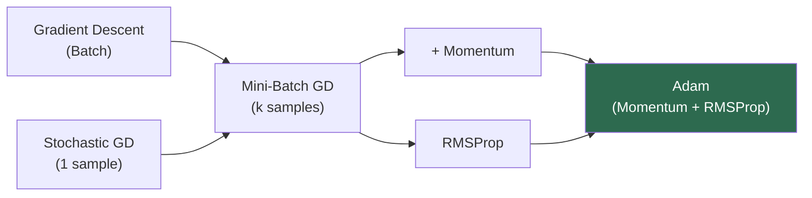

---

## 1. Batch Gradient Descent (BGD)

### Core Idea

Compute the gradient using **all** $m$ training examples, then take a single update step. This is the purest form of gradient descent.

### Algorithm

$$\nabla J(W) = \frac{1}{m} \sum_{i=1}^{m} \nabla J^{(i)}(W)$$

$$W \leftarrow W - \alpha \cdot \nabla J(W)$$

One pass through the entire dataset = one weight update.

### Step-by-step

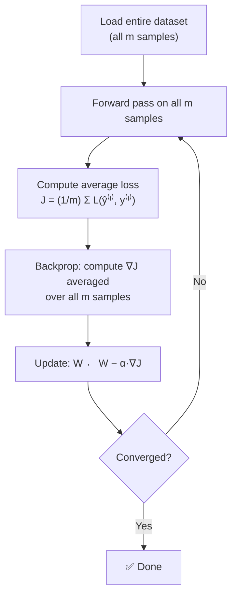

### Visualizing the Loss Curve

Batch GD produces a **smooth, monotonically decreasing** loss curve because every update uses the full data signal:

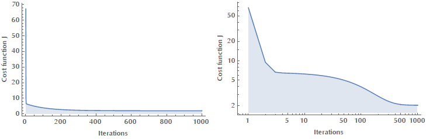

### Contour Plot Intuition

On a 2D loss surface (contour lines = equal loss), BGD takes **steady, precise steps** directly toward the minimum:

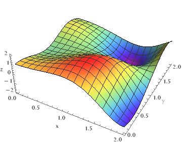

### Pros and Cons

| | |
|---|---|
| **Pros** | Stable, guaranteed convergence (convex); smooth loss curve; exact gradient |
| **Cons** | **Extremely slow** for large datasets — one update requires a full pass; entire dataset must fit in memory; cannot do online learning |

### When to Use

Only practical for **small datasets** (< 10,000 examples). For anything larger, mini-batch or SGD is required.

---

## 2. Stochastic Gradient Descent (SGD)

### Core Idea

Compute the gradient using **one randomly selected training example** and update immediately. With $m$ examples per epoch, you get $m$ updates.

### Algorithm

For each training example $(x^{(i)}, y^{(i)})$ drawn randomly:

$$\nabla J^{(i)}(W) = \nabla L(f(x^{(i)}; W),\, y^{(i)})$$

$$W \leftarrow W - \alpha \cdot \nabla J^{(i)}(W)$$

### Step-by-step

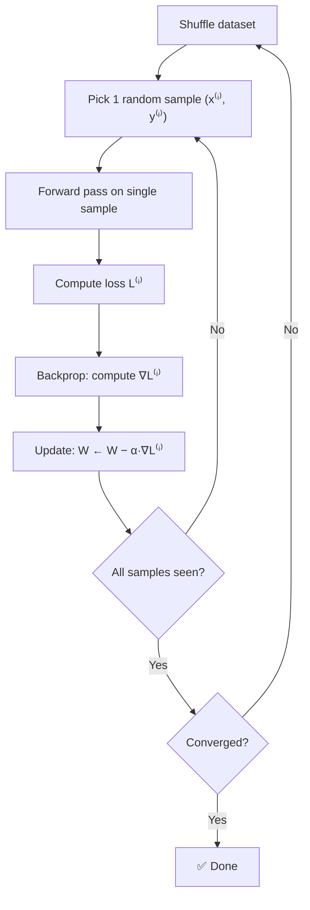

### Visualizing the Loss Curve

SGD is **noisy** — each step uses only 1 sample, so the gradient estimate is high-variance:

### Contour Plot Intuition

SGD bounces around erratically but still **converges on average** toward the minimum:

### The Noise is Sometimes Useful

The stochasticity in SGD acts as a form of **implicit regularization**:
- Helps **escape shallow local minima** and saddle points
- The noisy gradient can bounce the weights out of bad basins
- Often generalizes better than batch GD in practice

### Pros and Cons

| | |
|---|---|
| **Pros** | Very fast updates; can handle infinite/streaming data; escapes local minima; low memory (one sample at a time) |
| **Cons** | Very **noisy gradients** — high variance; erratic convergence; hard to parallelize; learning rate must be decayed to converge |

### Learning Rate Scheduling

Pure SGD requires a **decreasing learning rate** schedule to converge:

$$\alpha_t = \frac{\alpha_0}{1 + \text{decay} \cdot t}$$

Otherwise, the updates keep bouncing around the minimum and never settle.

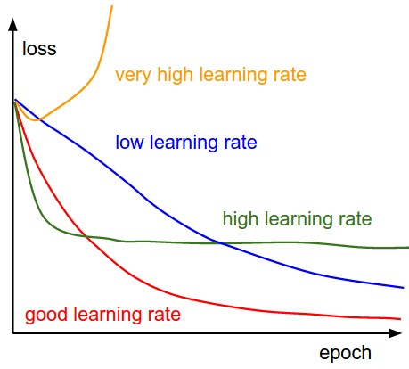

---

## 3. Mini-Batch Gradient Descent (MBGD)

### Core Idea

The practical sweet spot. Compute the gradient over a **small batch** of $B$ samples (typically 32–512), then update. This is what is actually meant by "SGD" in most deep learning frameworks.

### Algorithm

Split training set into mini-batches of size $B$. For each mini-batch $\mathcal{B}_t$:

$$\nabla J_{\mathcal{B}_t}(W) = \frac{1}{B} \sum_{i \in \mathcal{B}_t} \nabla L^{(i)}(W)$$

$$W \leftarrow W - \alpha \cdot \nabla J_{\mathcal{B}_t}(W)$$

Updates per epoch = $\lfloor m / B \rfloor$

### Step-by-step

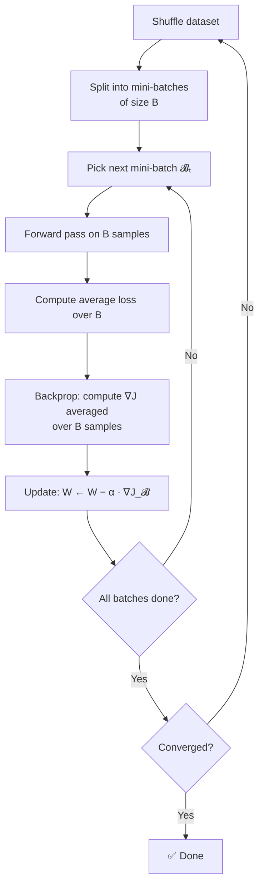

### Comparing the Three Variants

| Property | Batch GD | Mini-Batch GD | SGD |
|---|---|---|---|
| Gradient accuracy | Exact | Approximate | Very noisy |
| Update frequency | 1 per epoch | m/B per epoch | m per epoch |
| Memory usage | Entire dataset | One mini-batch | One sample |
| GPU utilization | High (if fits) | **High (optimal)** | Low |
| Convergence | Smooth | Slightly noisy | Very noisy |
| Parallelizable | Yes | **Yes (best)** | Barely |

### Choosing Batch Size

Batch size $B$ is a key hyperparameter with real trade-offs:

| Batch Size | Effect |
|---|---|
| **Smaller (8–64)** | Noisier gradients; acts as regularization; better generalization; slower hardware utilization |
| **Larger (256–2048)** | Sharper gradient estimates; faster per-epoch; risk of sharp minima; may generalize worse |
| **Powers of 2** | Aligns with GPU memory architecture — always use 32, 64, 128, 256, 512 |

> **Rule of thumb:** Start with **B = 32 or 64**. Larger batches may require increasing the learning rate proportionally (linear scaling rule: if you double batch size, double learning rate).

### Why Mini-Batch Dominates in Practice

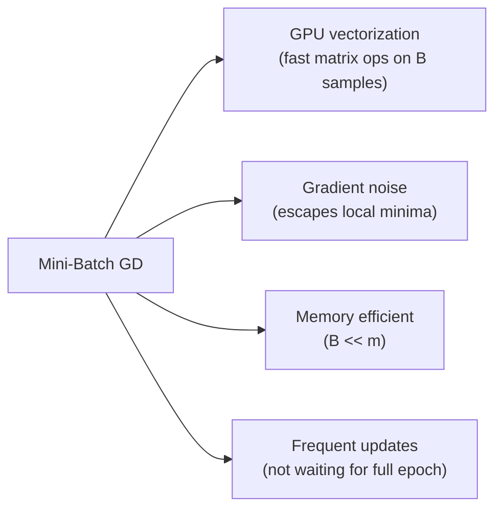

---

## 4. Gradient Descent with Momentum

### The Problem: Oscillation

On elongated, ravine-shaped loss surfaces — common in deep networks — vanilla gradient descent **oscillates** across the narrow direction while making slow progress along the valley floor:

The vertical oscillations waste steps. We want to **dampen** them and **accelerate** the horizontal progress.

### The Physical Analogy

Think of a ball rolling down a hill. Without momentum, it stops as soon as the slope becomes zero (saddle point). With momentum:
- The ball **accumulates velocity** as it rolls
- It **overshoots** small bumps and plateaus
- It naturally **dampens oscillations** in steep directions

### Algorithm

Momentum introduces a **velocity vector** $v$ that accumulates a decaying sum of past gradients:

$$v_t = \beta \cdot v_{t-1} + (1 - \beta) \cdot \nabla J(W_t)$$

$$W_{t+1} = W_t - \alpha \cdot v_t$$

Where:
- $\beta$ is the **momentum coefficient** (typically 0.9)
- $v_t$ is the **exponentially weighted moving average (EWMA)** of gradients
- $(1 - \beta)$ scales the current gradient contribution

> **Alternative formulation** (used in many frameworks — no $(1-\beta)$ scaling):
> $$v_t = \beta \cdot v_{t-1} + \nabla J(W_t)$$
> $$W_{t+1} = W_t - \alpha \cdot v_t$$
> These are equivalent with a rescaled $\alpha$. PyTorch uses this form.

### Exponentially Weighted Moving Average (EWMA)

The velocity is an EWMA of past gradients. Expanding the recursion:

$$v_t = (1-\beta)\left[\nabla J_t + \beta \nabla J_{t-1} + \beta^2 \nabla J_{t-2} + \cdots\right]$$

Each past gradient is weighted by $\beta^k$ — older gradients decay exponentially. The **effective memory window** ≈ $\frac{1}{1-\beta}$ steps.

| $\beta$ | Effective window | Effect |
|---|---|---|
| 0.5 | ~2 steps | Very short memory; nearly vanilla GD |
| 0.9 | ~10 steps | Standard momentum; smooth but reactive |
| 0.99 | ~100 steps | Very long memory; very smooth but slow to react |

### Why Momentum Dampens Oscillations

In the narrow direction (high oscillation), gradients **flip sign** each step:
$$+g, -g, +g, -g, \ldots$$

These cancel out in the EWMA → **velocity in oscillating direction ≈ 0** → dampened.

In the valley direction (consistent gradient), gradients keep the **same sign**:
$$+g, +g, +g, +g, \ldots$$

These accumulate in the EWMA → **velocity builds up** → **acceleration**.

### Visualizing Momentum Effect

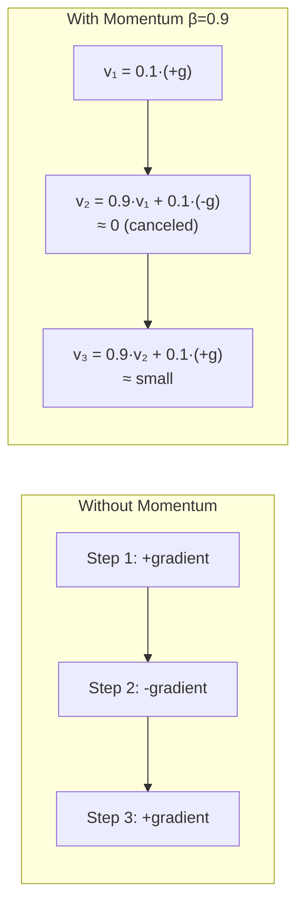

### Pros and Cons

| | |
|---|---|
| **Pros** | Dramatically **faster convergence** on ravines; escapes saddle points; smooths noisy gradients |
| **Cons** | One extra hyperparameter $\beta$; can **overshoot** minimum if $\beta$ or $\alpha$ too large |

### Nesterov Accelerated Gradient (NAG)

A smarter variant: **look ahead** before computing the gradient. Instead of computing gradient at current position $W_t$, compute it at the **anticipated position** $W_t - \beta v_{t-1}$:

$$v_t = \beta \cdot v_{t-1} + \alpha \cdot \nabla J(W_t - \beta v_{t-1})$$

$$W_{t+1} = W_t - v_t$$

NAG effectively "peeks" where momentum would take us and corrects before overshooting. This gives faster convergence and better theoretical guarantees.

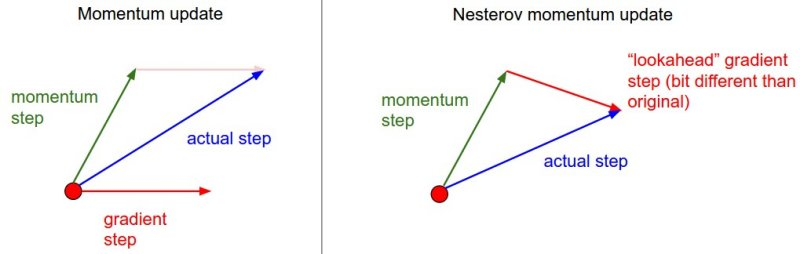

---

## 5. RMSProp (Root Mean Square Propagation)

### The Problem: Different Parameters Need Different Learning Rates

In practice, different parameters have gradients of vastly different magnitudes:
- Some weights receive **large, frequent gradients** → need a smaller learning rate
- Some weights receive **small, sparse gradients** → need a larger learning rate

A single global $\alpha$ is a poor fit. We want **per-parameter adaptive learning rates**.

### Core Idea

Keep a running average of the **squared gradients** for each parameter. Divide the update by the square root of this average. Parameters with historically large gradients get a **smaller effective learning rate**; sparse parameters get a **larger effective learning rate**.

### Algorithm

For each parameter $w_j$:

$$s_t = \beta \cdot s_{t-1} + (1 - \beta) \cdot (\nabla J_t)^2$$

$$w_j \leftarrow w_j - \frac{\alpha}{\sqrt{s_t + \epsilon}} \cdot \nabla J_t$$

Where:
- $s_t$ is the EWMA of **squared gradients** (element-wise)
- $\beta$ is the decay rate (typically **0.9**)
- $\epsilon$ is a small constant (e.g. $10^{-8}$) to prevent division by zero
- $\frac{\alpha}{\sqrt{s_t + \epsilon}}$ is the **adaptive per-parameter learning rate**

### What $s_t$ Measures

$s_t$ approximates the **recent gradient variance** for each parameter. If a parameter's gradient is consistently large:

$$s_t \approx \mathbb{E}[g^2] \text{ (large)} \implies \frac{\alpha}{\sqrt{s_t}} \text{ (small learning rate)}$$

If a parameter's gradient is consistently small or sparse:

$$s_t \approx \mathbb{E}[g^2] \text{ (small)} \implies \frac{\alpha}{\sqrt{s_t}} \text{ (large learning rate)}$$

### Visualizing the Adaptive Effect

```
Parameter A (large gradients):
  s_t = 4.0  →  effective lr = α/√4 = α/2    (halved)

Parameter B (small gradients):
  s_t = 0.04 →  effective lr = α/√0.04 = 5α  (5× larger)
```

This naturally handles **feature sparsity** and **imbalanced gradient scales** — common in NLP with embeddings.

### Comparison: Momentum vs RMSProp

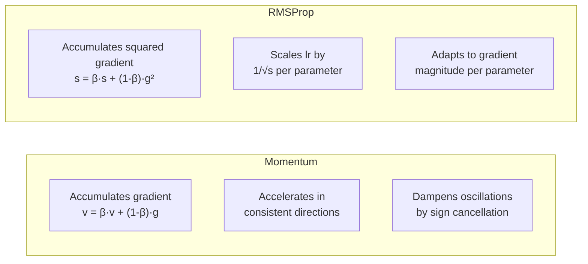

| | Momentum | RMSProp |
|---|---|---|
| **Accumulates** | Gradient direction | Squared gradient magnitude |
| **Effect** | Velocity / acceleration | Per-parameter learning rate scaling |
| **Fixes** | Oscillation on ravines | Imbalanced gradient scales |
| **Typical $\beta$** | 0.9 | 0.9 |

### Pros and Cons

| | |
|---|---|
| **Pros** | Works well for **non-stationary objectives**; handles sparse gradients well; good for RNNs |
| **Cons** | $s_t$ accumulation can grow **too large over time** → learning rate decays to near zero (same issue as AdaGrad); no bias correction |

> **RMSProp was proposed by Geoffrey Hinton in a Coursera lecture (2012) — it was never published in a formal paper. It fixes AdaGrad's main weakness: the monotonically growing denominator.**

---

## 6. Adam (Adaptive Moment Estimation)

### Core Idea: Momentum + RMSProp

Adam combines the best of both worlds:
- **First moment** (from Momentum): EWMA of gradients → accelerates in consistent directions
- **Second moment** (from RMSProp): EWMA of squared gradients → adapts learning rate per parameter

Plus a critical addition: **bias correction** for the cold-start problem.

### Algorithm

Initialize: $m_0 = 0$, $v_0 = 0$, $t = 0$

For each step $t$:

**Step 1 — Compute gradient:**
$$g_t = \nabla J(W_t)$$

**Step 2 — Update first moment (mean of gradients):**
$$m_t = \beta_1 \cdot m_{t-1} + (1 - \beta_1) \cdot g_t$$

**Step 3 — Update second moment (uncentered variance of gradients):**
$$v_t = \beta_2 \cdot v_{t-1} + (1 - \beta_2) \cdot g_t^2$$

**Step 4 — Bias correction:**
$$\hat{m}_t = \frac{m_t}{1 - \beta_1^t}, \qquad \hat{v}_t = \frac{v_t}{1 - \beta_2^t}$$

**Step 5 — Update weights:**
$$W_{t+1} = W_t - \frac{\alpha}{\sqrt{\hat{v}_t} + \epsilon} \cdot \hat{m}_t$$

### Why Bias Correction?

At $t=1$, starting from $m_0 = v_0 = 0$:

$$m_1 = (1 - \beta_1) \cdot g_1 = 0.1 \cdot g_1$$

This is a severe **underestimate** of the true mean. The bias correction divides by $(1 - \beta_1^t)$:

$$\hat{m}_1 = \frac{m_1}{1 - 0.9^1} = \frac{0.1 \cdot g_1}{0.1} = g_1 \checkmark$$

As $t \to \infty$: $(1 - \beta_1^t) \to 1$, so bias correction becomes negligible. It only matters in **early training**.

```
Without bias correction:        With bias correction:
  t=1:  m₁ = 0.1·g₁ (underestimate!)   t=1:  m̂₁ = g₁ ✓
  t=10: m₁₀ ≈ 0.65·ḡ (still off)       t=10: m̂₁₀ ≈ ḡ ✓
  t=100: m₁₀₀ ≈ ḡ (converged)          t=100: m̂₁₀₀ = ḡ ✓
```

### Effective Learning Rate

The actual per-parameter step size in Adam at time $t$:

$$\alpha_{\text{eff}} = \alpha \cdot \frac{\sqrt{1 - \beta_2^t}}{1 - \beta_1^t}$$

This is bounded: $\alpha_{\text{eff}} \leq \alpha \cdot \frac{\sqrt{1-\beta_2}}{1-\beta_1}$. Adam **self-limits** step sizes regardless of gradient magnitude.

### Full Adam Flow

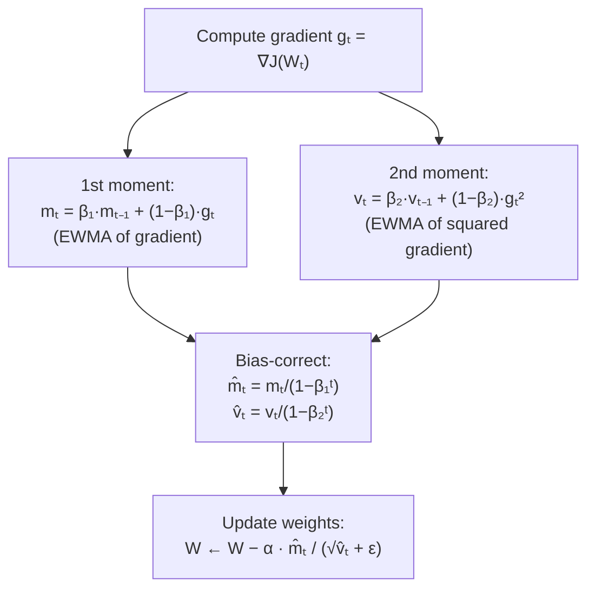

### Default Hyperparameters

These defaults from the original paper (Kingma & Ba, 2014) work well for almost every problem:

| Hyperparameter | Default | Role |
|---|---|---|
| $\alpha$ | 0.001 | Global learning rate |
| $\beta_1$ | **0.9** | 1st moment decay (momentum) |
| $\beta_2$ | **0.999** | 2nd moment decay (RMSProp) |
| $\epsilon$ | **1e-8** | Numerical stability |

> **Adam is remarkably robust to hyperparameter choice.** In most cases, the defaults work. The only hyperparameter worth tuning is $\alpha$.

### Adam vs Momentum vs RMSProp


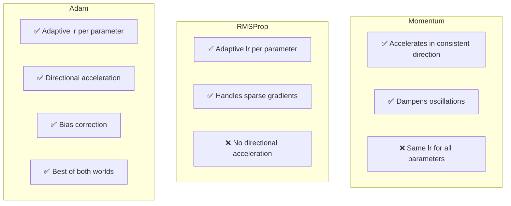

### Pros and Cons

| | |
|---|---|
| **Pros** | Fast convergence; works out-of-the-box on most problems; handles sparse gradients; bias correction; adaptive per-parameter lr |
| **Cons** | Can **converge to sharp minima** that generalize worse than SGD; memory: 2× extra vectors ($m$, $v$) per parameter; may not generalize as well as SGD+momentum on some CV tasks |

> **Adam vs SGD generalization debate:** Adam often finds a solution faster, but SGD with careful tuning sometimes finds a better-generalizing minimum. In NLP/Transformers: Adam. In vision/ResNets: SGD+momentum often wins on final accuracy.

---

## Summary: All Algorithms Side by Side

### Update Rules

| Algorithm | Update Rule |
|---|---|
| **Batch GD** | $W \leftarrow W - \alpha \cdot \frac{1}{m}\sum \nabla L^{(i)}$ |
| **SGD** | $W \leftarrow W - \alpha \cdot \nabla L^{(i)}$ |
| **Mini-Batch GD** | $W \leftarrow W - \alpha \cdot \frac{1}{B}\sum_{i \in \mathcal{B}} \nabla L^{(i)}$ |
| **Momentum** | $v \leftarrow \beta v + (1-\beta)\nabla J$; $W \leftarrow W - \alpha v$ |
| **RMSProp** | $s \leftarrow \beta s + (1-\beta)(\nabla J)^2$; $W \leftarrow W - \frac{\alpha}{\sqrt{s+\epsilon}} \nabla J$ |
| **Adam** | $m, v$ updates + bias correction; $W \leftarrow W - \frac{\alpha}{\sqrt{\hat{v}}+\epsilon}\hat{m}$ |

### Full Comparison Table

| Property | Batch GD | SGD | Mini-Batch GD | Momentum | RMSProp | Adam |
|---|---|---|---|---|---|---|
| Gradient noise | None | Very high | Low-medium | Low | Low | Low |
| Convergence speed | Slow | Fast (noisy) | **Fast** | **Faster** | **Faster** | **Fastest** |
| Adaptive lr | No | No | No | No | Yes | Yes |
| Directional memory | No | No | No | Yes | No | Yes |
| Memory overhead | 1x | 1x | 1x | 2x | 2x | 3x |
| Escapes saddle pts | Poor | Good | Medium | Good | Medium | Good |
| Generalization | Good | Good | Good | Good | Medium | Medium-Good |
| Typical use | Tiny datasets | Online learning | **Standard** | Vision | RNNs, NLP | **Default for DL** |

### Convergence on Loss Landscape

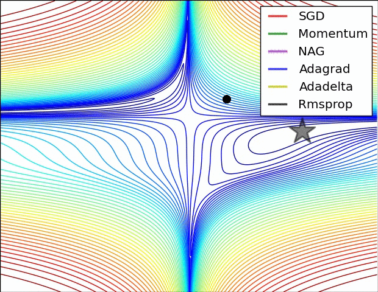

### Hyperparameter Reference

| Algorithm | Key HPs | Typical Values |
|---|---|---|
| All GD variants | Learning rate $\alpha$ | 0.1, 0.01, 0.001 |
| Momentum | $\beta$ | 0.9 |
| RMSProp | $\beta$, $\epsilon$ | 0.9, 1e-8 |
| Adam | $\beta_1$, $\beta_2$, $\epsilon$, $\alpha$ | 0.9, 0.999, 1e-8, 0.001 |

---

## Practical Decision Guide

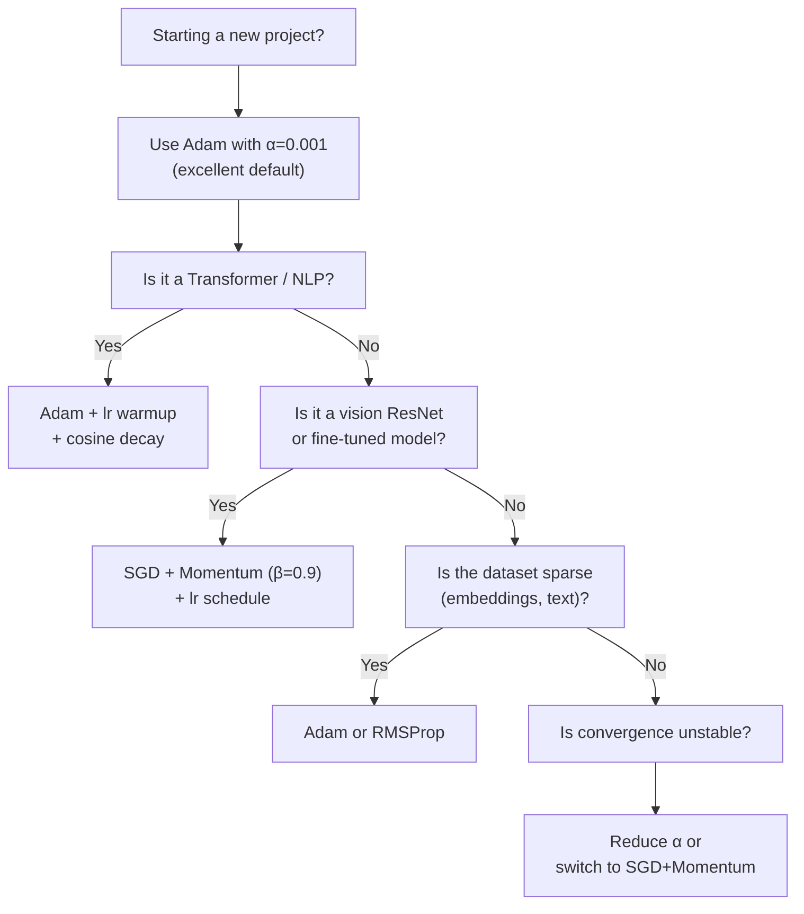

> **Bottom line:** Start with **Adam**. If you need maximum generalization (e.g., ImageNet-scale vision), switch to **SGD + Momentum** and tune carefully. Never use pure Batch GD on real datasets.
