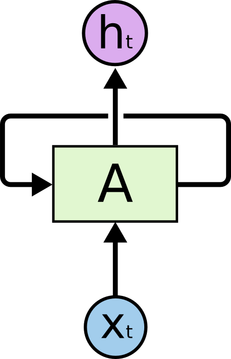
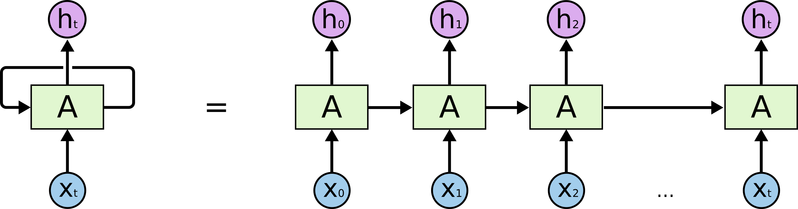
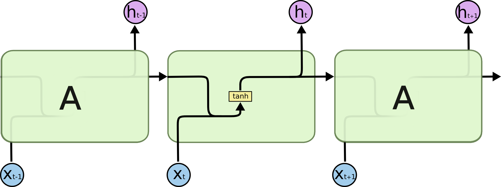
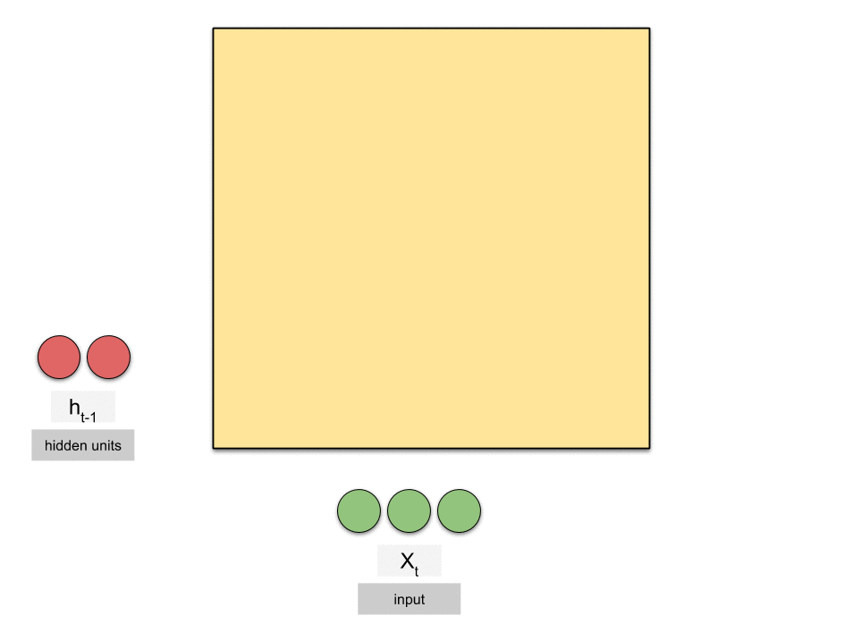
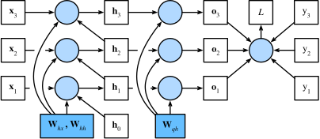
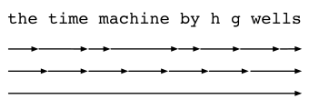

# Recurrent Neural Networks (RNN)

---

## 1. Why RNN? — The Limitations of ANN for Sequential Data

### What ANN Does Well

A standard feedforward ANN (Artificial Neural Network) maps a **fixed-size input** to a **fixed-size output**. Given an input vector **x**, it produces an output **y** by passing through hidden layers.

This works great for tasks like image classification, tabular data prediction, etc. — where each sample is **independent** and has a **fixed structure**.

---

### The Problem: Sequential & Temporal Data

Many real-world problems involve data where **order matters** and where **context from previous inputs** is needed to understand the current input.

| Domain | Example | Why order matters |
|---|---|---|
| NLP | "not good" vs "good" | "not" changes meaning of "good" |
| Time Series | Stock prices | Yesterday's price affects today's prediction |
| Speech | "recognize speech" vs "wreck a nice beach" | Phoneme context resolves ambiguity |
| Video | Action recognition | Frame sequence defines the action |

---

### Attempt 1: Feed the Entire Sequence into an ANN

A naive fix: flatten the whole sequence and feed it as one big input vector.

**Problems with this approach:**

1. **Fixed sequence length required** — ANN needs a fixed input size. Real sequences vary in length (sentences, audio clips, time windows).

2. **No weight sharing** — Position 1 and Position 5 use completely different weights even though the same pattern at different positions should mean the same thing.

3. **Parameter explosion** — A sequence of length T with input dimension d means T×d inputs. For long sequences (e.g., a paragraph of 500 words), this becomes enormous.

4. **No generalization across positions** — If the model learns that "not" negates the word after it at position 3, it has no way to apply that knowledge when "not" appears at position 7.

---

### Attempt 2: Sliding Window ANN

Feed a fixed-size window of recent inputs at each time step.

**Still problematic:**

- Window size is a hard limit on how far back the model can "see"
- Long-range dependencies are lost (e.g., subject-verb agreement across 20 words)
- Each window is processed **independently** — no continuity of state across time steps

---

### The Core Insight RNN Addresses

> **An ANN has no memory. It sees one input and forgets everything.**

For sequential data, we need a model that:

1. Processes inputs **one step at a time**
2. Maintains a **hidden state** — a summary of everything seen so far
3. Updates that state at each step using **both** the new input and the previous state
4. Uses **shared weights** across all time steps

This is exactly what an RNN does.

---

### ANN vs RNN: Side-by-Side

An ANN processes each timestep completely independently — no information passes between steps. An RNN passes a hidden state from one timestep to the next, giving it memory of the past.

| Property | ANN | RNN |
|---|---|---|
| Input type | Fixed-size vector | Variable-length sequence |
| Memory of past | None | Hidden state hₜ |
| Weight sharing across time | No | Yes |
| Handles variable-length input | No | Yes |
| Captures long-range dependencies | No | Yes (in theory) |
| Parameter count grows with sequence length | Yes | No |

---

> **Next:** [How RNN Works — Architecture & Forward Pass](#2-how-rnn-works--architecture--forward-pass)

---

## 2. How RNN Works — Architecture & Forward Pass

### The Big Picture

An RNN can be thought of as the same network applied repeatedly — each copy passes its hidden state to the next. The **rolled** view shows the loop; the **unrolled** view shows one copy per timestep:

**Rolled (compact) view:**



**Unrolled through time:**



> *Diagrams credit: [Colah's Blog — Understanding LSTM Networks](https://colah.github.io/posts/2015-08-Understanding-LSTMs/)*

At each time step, the RNN takes:
- The **current input** xₜ
- The **previous hidden state** hₜ₋₁ (its memory of the past)

And produces:
- A **new hidden state** hₜ (updated memory)
- Optionally, an **output** ŷₜ

The same cell — with the **same weights** — is applied at every time step.

---

### The RNN Cell: Inside the Box

The hidden state update is a simple equation:

```
hₜ = tanh( W·xₜ  +  U·hₜ₋₁  +  b )
```

| Symbol | Shape | Role |
|---|---|---|
| xₜ | (input_dim,) | Current input at time t |
| hₜ₋₁ | (hidden_dim,) | Hidden state from previous step |
| **W** | (hidden_dim × input_dim) | Weight matrix for input |
| **U** | (hidden_dim × hidden_dim) | Weight matrix for hidden state (recurrent weights) |
| **b** | (hidden_dim,) | Bias |
| hₜ | (hidden_dim,) | New hidden state |
| tanh | — | Activation (squashes values to [-1, 1]) |

The output at each step (if needed) is:

```
ŷₜ = softmax( V·hₜ  +  c )
```

Where **V** and **c** are the output weight matrix and bias.

### SimpleRNN Repeating Module



> *Diagram credit: [Colah's Blog — Understanding LSTM Networks](https://colah.github.io/posts/2015-08-Understanding-LSTMs/)*

---

### Step-by-Step Forward Pass Example

Say we have the sequence: **["I", "love", "RNNs"]** and hidden size = 3.

**Step 0:** Initialize
```
h₀ = [0, 0, 0]
```

**Step 1:** Process "I" → x₁
```
h₁ = tanh( W · x₁  +  U · h₀  +  b )
   = tanh( W · x₁  +  U · [0,0,0]  +  b )
   = tanh( W · x₁  +  b )         ← no past context yet
```

**Step 2:** Process "love" → x₂
```
h₂ = tanh( W · x₂  +  U · h₁  +  b )
                            ↑
                   now influenced by "I"
```

**Step 3:** Process "RNNs" → x₃
```
h₃ = tanh( W · x₃  +  U · h₂  +  b )
                            ↑
               influenced by "I" and "love"
```

By step 3, **h₃ encodes context from the entire sequence**. This is what you'd use as the final representation (e.g., for sentiment classification).

---

### Why tanh?

- Squashes output to **[-1, 1]** — prevents hidden state values from exploding as they accumulate over many steps
- Centered at 0 — positive and negative states are equally representable
- Differentiable — required for backpropagation

---

### Parameter Count

Unlike ANN with a flattened sequence, RNN's parameter count is **independent of sequence length**:

| Parameter | Count |
|---|---|
| W (input → hidden) | hidden_dim × input_dim |
| U (hidden → hidden) | hidden_dim × hidden_dim |
| b (bias) | hidden_dim |
| V (hidden → output) | output_dim × hidden_dim |
| c (output bias) | output_dim |

The same parameters handle a sequence of length 5 or length 500 — this is the power of weight sharing.

---

### What the Hidden State Represents

The hidden state hₜ is a **learned, compressed summary** of the sequence x₁, x₂, ..., xₜ. It is not hand-crafted — the network learns what information is worth preserving through training.

After seeing "not" in "The movie was not good", the hidden state carries a signal that negates what follows — something a static ANN cannot do.

---

## Types of RNN Architectures

RNNs are flexible — the number of inputs and outputs can vary independently. This gives rise to four main architectural patterns:


> *Diagram credit: [CS231n — Recurrent Neural Networks](https://cs231n.github.io/rnn/)*

### Information Flow Animation



> *Animation credit: [Raimi Karim — Animated RNN, LSTM and GRU](https://medium.com/data-science/animated-rnn-lstm-and-gru-ef124d06cf45)*

---

### 1. Many-to-One

**Many inputs → One output**

The RNN processes a full sequence and produces a single output at the last timestep. All intermediate hidden states are discarded; only the final hidden state feeds into the output layer.

**Use cases:** Sentiment analysis, text classification, spam detection

**Keras:** `return_sequences=False` (default)

```python
model.add(SimpleRNN(32, return_sequences=False))
model.add(Dense(1, activation='sigmoid'))
```

---

### 2. One-to-Many

**One input → Many outputs**

A single input (or a fixed context vector) is fed in at the first timestep, and the network generates a sequence of outputs — one at each timestep.

**Use cases:** Image captioning (image → sequence of words), music generation

---

### 3. Many-to-Many (Synced)

**Many inputs → Many outputs (same length)**

The network produces one output at every timestep, aligned with each input.

**Use cases:** POS tagging, Named Entity Recognition (NER), video frame labelling

**Keras:** `return_sequences=True`

```python
model.add(SimpleRNN(32, return_sequences=True))
model.add(Dense(num_classes, activation='softmax'))
```

---

### 4. Many-to-Many (Encoder-Decoder)

**Many inputs → Many outputs (different lengths)**

Two RNNs are chained together:
- **Encoder** reads the full input sequence and compresses it into a context vector (final hidden state)
- **Decoder** takes that context vector and generates the output sequence

**Use cases:** Machine translation, text summarization, chatbots

---

### Summary Table

| Architecture     | Input    | Output   | `return_sequences` | Example                  |
|------------------|----------|----------|--------------------|--------------------------|
| Many-to-One      | Sequence | Single   | `False`            | Sentiment analysis       |
| One-to-Many      | Single   | Sequence | `True`             | Image captioning         |
| Many-to-Many (synced) | Sequence | Sequence (same len) | `True` | POS tagging        |
| Many-to-Many (enc-dec) | Sequence | Sequence (diff len) | Both  | Translation        |

---

## Backpropagation Through Time (BPTT)

In a standard feedforward network, backpropagation computes gradients layer by layer. In an RNN, the network is **unrolled through time** — each timestep becomes a layer — and gradients flow backwards through all of them. This is called **Backpropagation Through Time (BPTT)**.

### Computational Graph & Gradient Flow



> *Diagram credit: [Dive into Deep Learning — Backpropagation Through Time](https://d2l.ai/chapter_recurrent-neural-networks/bptt.html)*

**Forward pass:** compute h₁, h₂, h₃, ŷ, and Loss L as normal.

**Backward pass:** starting from the loss, gradients flow back through every timestep. At each timestep, the same weight matrices **Wₓ** (input) and **Wₕ** (recurrent) are used. So gradients from all timesteps are **summed** to update a single set of shared weights.

---

### The Chain Rule Across Time

The recurrence relation is:

```
hₜ = tanh(Wₓ · xₜ + Wₕ · hₜ₋₁ + b)
```

To compute ∂L/∂Wₕ, the chain rule must be applied at every timestep back to t=1:

```
∂L     T    ∂L    ∂hₜ   ∂hₜ₋₁       ∂h₁
―― =  Σ   ――― · ――― · ――――― · ... · ―――
∂Wₕ   t=1  ∂hₜ   ∂hₜ  ∂hₜ₋₁        ∂Wₕ
```

Each step multiplies by **∂hₜ/∂hₜ₋₁**, which involves Wₕ repeatedly — this repeated multiplication is the root cause of problems covered in the next section.

---

### Truncated BPTT

For long sequences, unrolling all the way back to t=1 is computationally expensive. **Truncated BPTT** limits how far back gradients are propagated.



> *Diagram credit: [Dive into Deep Learning — Backpropagation Through Time](https://d2l.ai/chapter_recurrent-neural-networks/bptt.html)*

This is commonly used in practice for training on long sequences.

---

## Problems with BPTT — Vanishing and Exploding Gradients

From the previous section, the gradient at each timestep multiplies by **∂hₜ/∂hₜ₋₁** repeatedly. Since:

```
hₜ = tanh(Wₕ · hₜ₋₁ + Wₓ · xₜ + b)
```

The gradient through one timestep is:

```
∂hₜ/∂hₜ₋₁ = diag(tanh'(·)) · Wₕ
```

Over T timesteps, this term is multiplied T times — equivalent to computing **Wₕᵀ**. The behaviour of this product depends entirely on the magnitude of Wₕ's eigenvalues.

---

### 1. Vanishing Gradients

**What happens:** If the eigenvalues of Wₕ are < 1 (or tanh squashes values hard), the product shrinks exponentially with T:

```
T=1:   gradient = 0.9
T=5:   gradient = 0.9⁵  = 0.59
T=10:  gradient = 0.9¹⁰ = 0.35
T=50:  gradient = 0.9⁵⁰ ≈ 0.005  ← nearly zero
```

Early timesteps receive almost **no gradient signal** — the network effectively cannot learn long-range dependencies.

**Symptom:** The model only learns from the last few words of a sequence, ignoring earlier context. Training loss plateaus early.

#### Fixes for Vanishing Gradients

| Fix | How it helps |
|-----|-------------|
| **LSTM / GRU** | Gating mechanisms maintain a separate cell state with additive updates, preventing gradient from being repeatedly multiplied to zero. The primary solution. |
| **Gradient clipping** | Partial help only — clipping doesn't fix vanishing, only exploding. |
| **ReLU activation** | Gradient of ReLU is 1 (not squashed), reducing vanishing. But can cause exploding gradients instead. |
| **Truncated BPTT** | Limits how far back gradients flow — avoids extreme vanishing but also limits long-range learning. |
| **Better weight initialisation** | Initialising Wₕ as an orthogonal matrix keeps eigenvalues near 1 at the start of training. |

---

### 2. Exploding Gradients

**What happens:** If the eigenvalues of Wₕ are > 1, the product grows exponentially with T:

```
T=1:   gradient = 1.1
T=5:   gradient = 1.1⁵  = 1.61
T=10:  gradient = 1.1¹⁰ = 2.59
T=50:  gradient = 1.1⁵⁰ ≈ 117  ← massive
```

Weights receive huge updates, causing the loss to diverge or produce NaN values.

**Symptom:** Loss suddenly spikes to NaN or infinity during training. Weights become very large.

#### Fixes for Exploding Gradients

| Fix | How it helps |
|-----|-------------|
| **Gradient clipping** | Caps the gradient norm to a maximum threshold before the weight update. The most common fix. |
| **LSTM / GRU** | Gating naturally limits how much information flows, keeping gradients bounded. |
| **Smaller learning rate** | Reduces the impact of large gradient updates, but doesn't fix the root cause. |
| **Weight regularisation (L2)** | Penalises large weights, indirectly limiting how large Wₕ eigenvalues can grow. |

**Gradient clipping in Keras:**
```python
optimizer = tf.keras.optimizers.Adam(clipnorm=1.0)  # clips gradient norm to 1.0
```

---

### Summary

| Problem | Cause | Effect | Primary Fix |
|---------|-------|--------|-------------|
| Vanishing gradient | Eigenvalues of Wₕ < 1, tanh saturation | Cannot learn long-range dependencies | LSTM / GRU |
| Exploding gradient | Eigenvalues of Wₕ > 1 | Loss diverges, NaN weights | Gradient clipping |

Both problems are why vanilla SimpleRNN is rarely used in practice for long sequences. **LSTM and GRU** were specifically designed to solve the vanishing gradient problem.
