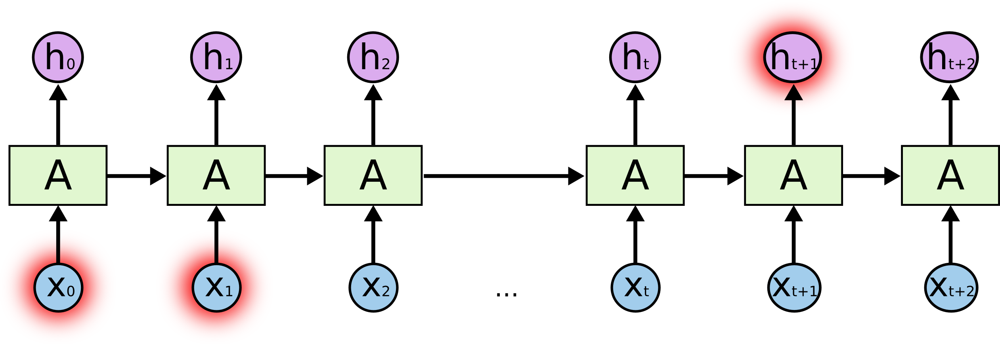
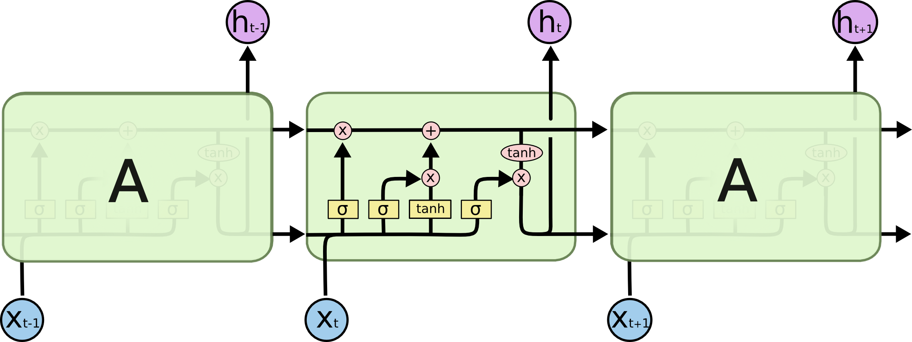
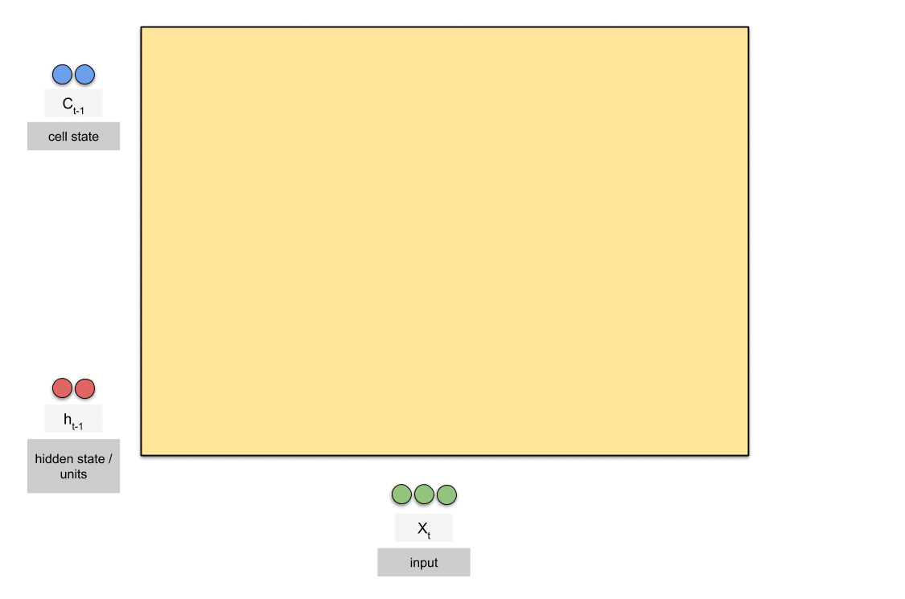
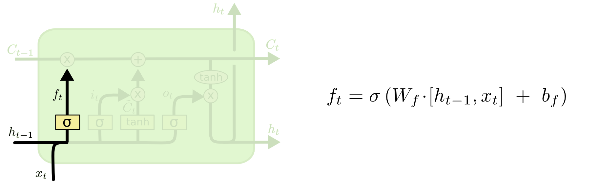
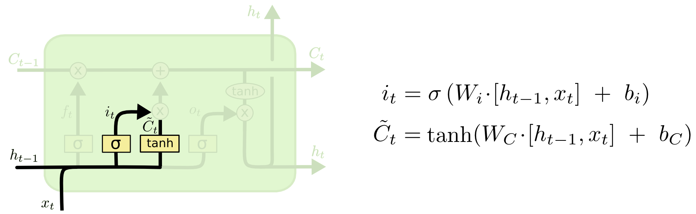
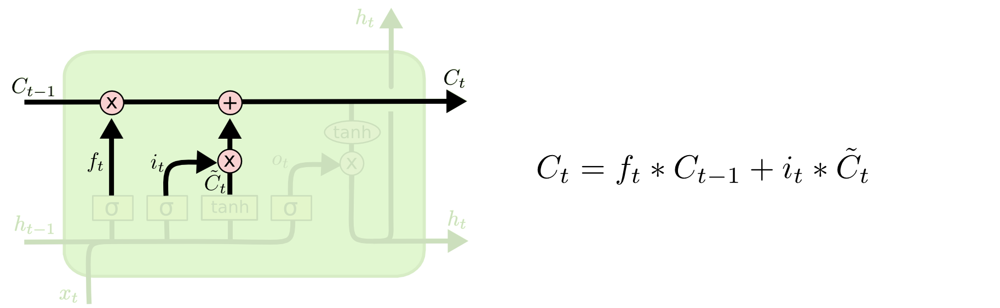
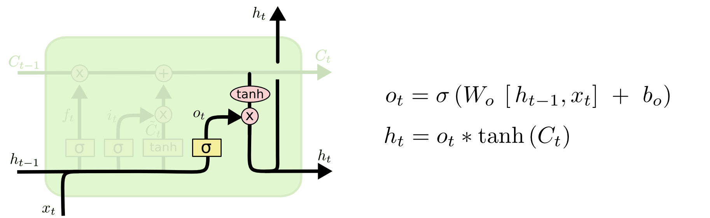
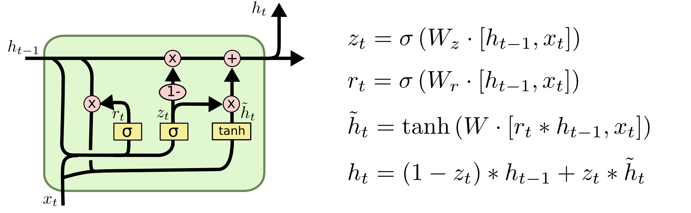
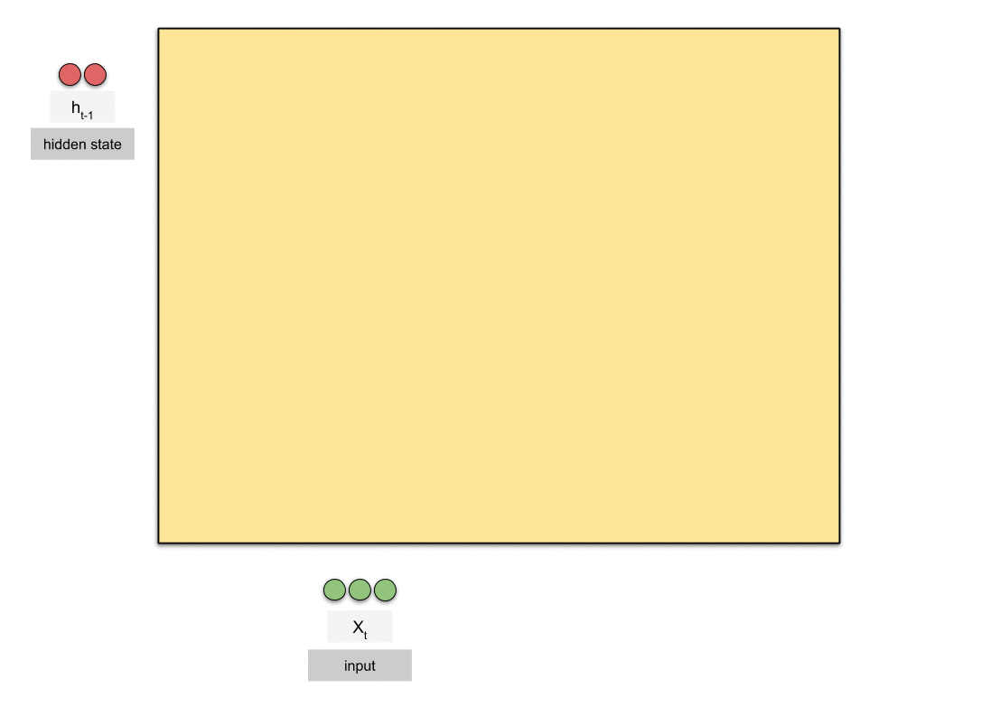
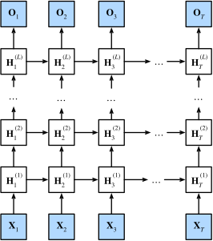

# LSTM (Long Short-Term Memory)

---

## What is an LSTM?

LSTM is a special type of RNN introduced by **Hochreiter & Schmidhuber (1997)** specifically to solve the vanishing gradient problem. While a vanilla RNN has a single hidden state that gets overwritten at every timestep, an LSTM has a more sophisticated internal structure that allows it to **selectively remember and forget** information over long sequences.

The key insight: instead of one hidden state, an LSTM maintains **two** separate states:

| State | Symbol | Role |
|-------|--------|------|
| **Hidden state** | hₜ | Short-term memory — passed to the next timestep and to the output |
| **Cell state** | Cₜ | Long-term memory — a "conveyor belt" that runs through the sequence with minimal modification |

The cell state is the critical innovation. It flows through time with only **additive** updates (no repeated multiplication), which is what prevents gradients from vanishing.

---

## The Problem with SimpleRNN (Recap)



A SimpleRNN must connect `cat` to `was` through ~10 timesteps of repeated Wₕ multiplication. The gradient signal disappears before it reaches `cat`.

An LSTM solves this by keeping a separate cell state that can carry `cat` forward without degradation.

---

## LSTM Architecture

### High-Level View

At each timestep t, an LSTM cell takes three inputs and produces two outputs:



### Information Flow Animation

The animation below shows how data flows through an LSTM cell at each timestep — through the forget gate, input gate, cell state update, and output gate:



> *Animation credit: [Raimi Karim — Animated RNN, LSTM and GRU](https://medium.com/data-science/animated-rnn-lstm-and-gru-ef124d06cf45)*

---

### Inside the LSTM Cell — The Four Gates


> *Notation guide:*
> 

---

### Gate 1 — Forget Gate (fₜ)

**Question it answers:** *What information from the past cell state should we throw away?*

```
fₜ = σ(Wf · [hₜ₋₁, xₜ] + bf)
```

- Output is between 0 and 1 (sigmoid)
- **0** = completely forget, **1** = completely keep
- Applied element-wise to Cₜ₋₁



**Example:** In "The cat was hungry. The dog was tired.", when the model moves to the second sentence, the forget gate discards information about `cat` to focus on `dog`.

---

### Gate 2 — Input Gate (iₜ) + Candidate Cell State (g̃ₜ)

**Question it answers:** *What new information should we store in the cell state?*

```
iₜ  = σ(Wi · [hₜ₋₁, xₜ] + bi)     ← how much to write (0 to 1)
g̃ₜ  = tanh(Wg · [hₜ₋₁, xₜ] + bg)  ← what to write (-1 to 1)
```



- `iₜ` decides which positions to update
- `g̃ₜ` is the actual candidate values to potentially add

---

### Cell State Update

The new cell state combines the forget and input gates:

```
Cₜ = fₜ ⊙ Cₜ₋₁  +  iₜ ⊙ g̃ₜ
```



`⊙` = element-wise multiplication

This is the key equation. The update is **additive** — gradients flow back through addition, not multiplication, preventing vanishing.

---

### Gate 3 — Output Gate (oₜ)

**Question it answers:** *What part of the cell state should we expose as the hidden state?*

```
oₜ = σ(Wo · [hₜ₋₁, xₜ] + bo)
hₜ = oₜ ⊙ tanh(Cₜ)
```



- The cell state is squashed through tanh (range -1 to 1)
- The output gate selects which parts of it to expose
- `hₜ` is what gets passed to the next timestep and to the output layer

---

## Full LSTM Equations Summary

```
fₜ = σ(Wf · [hₜ₋₁, xₜ] + bf)         ← forget gate
iₜ = σ(Wi · [hₜ₋₁, xₜ] + bi)         ← input gate
g̃ₜ = tanh(Wg · [hₜ₋₁, xₜ] + bg)      ← candidate cell state
oₜ = σ(Wo · [hₜ₋₁, xₜ] + bo)         ← output gate

Cₜ = fₜ ⊙ Cₜ₋₁ + iₜ ⊙ g̃ₜ            ← new cell state
hₜ = oₜ ⊙ tanh(Cₜ)                    ← new hidden state
```

All four weight matrices (Wf, Wi, Wg, Wo) are learned during training.

---

## Why the Cell State Prevents Vanishing Gradients


In a SimpleRNN, the gradient must pass through tanh and Wₕ at every timestep — a product of many terms < 1.

In an LSTM, the gradient of the loss with respect to Cₜ₋₁ passes through the **forget gate only**:

```
∂Cₜ/∂Cₜ₋₁ = fₜ
```

This is a single multiplicative term that the network **learns to keep near 1** when long-range memory is needed. The gradient highway through the cell state remains intact over many timesteps.

---

## LSTM vs SimpleRNN — Parameter Count

For hidden size `h` and input size `x`:

| Model | Parameters |
|-------|-----------|
| SimpleRNN | h(h + x) + h |
| LSTM | 4 × [h(h + x) + h] |

An LSTM has **4× more parameters** than a SimpleRNN of the same size — one set for each gate.

---

## LSTM in Keras

```python
from keras import Sequential, Input
from keras.layers import LSTM, Dense

model = Sequential([
    Input(shape=(timesteps, features)),
    LSTM(128, return_sequences=False),
    Dense(1, activation='sigmoid')
])
model.summary()
```

For stacked LSTMs:
```python
model = Sequential([
    Input(shape=(timesteps, features)),
    LSTM(128, return_sequences=True),   # must return sequences for next LSTM
    LSTM(64, return_sequences=False),
    Dense(1, activation='sigmoid')
])
```

---

---

## GRU (Gated Recurrent Unit) — A Simpler Alternative to LSTM

GRU was introduced by **Cho et al. (2014)** as a streamlined version of LSTM. It achieves similar performance on most tasks but with **fewer parameters and faster training** by merging the LSTM's two states and three gates into one state and two gates.

---

### Key Difference from LSTM

| | LSTM | GRU |
|---|---|---|
| States | 2 (hidden state + cell state) | 1 (hidden state only) |
| Gates | 3 (forget, input, output) | 2 (update, reset) |
| Parameters | 4 × h(h+x) | 3 × h(h+x) |

The cell state (long-term memory) is **merged into the hidden state** in a GRU. There is no separate output gate.

---

### GRU Architecture



> *Diagram credit: [Colah's Blog — Understanding LSTM Networks](https://colah.github.io/posts/2015-08-Understanding-LSTMs/)*

### Information Flow Animation



> *Animation credit: [Raimi Karim — Animated RNN, LSTM and GRU](https://medium.com/data-science/animated-rnn-lstm-and-gru-ef124d06cf45)*

---

### Gate 1 — Update Gate (zₜ)

**Question it answers:** *How much of the past hidden state should carry forward vs. be replaced with new info?*

```
zₜ = σ(Wz · [hₜ₋₁, xₜ] + bz)
```

- Output between 0 and 1
- **1** = keep old hidden state entirely (ignore new input)
- **0** = replace entirely with new candidate
- Combines the role of LSTM's **forget gate + input gate** in one

---

### Gate 2 — Reset Gate (rₜ)

**Question it answers:** *How much of the past hidden state should influence the new candidate?*

```
rₜ = σ(Wr · [hₜ₋₁, xₜ] + br)
```

- **0** = completely ignore past hidden state when computing candidate (short-term reset)
- **1** = use full past hidden state

---

### Candidate Hidden State

```
h̃ₜ = tanh(W · [rₜ ⊙ hₜ₋₁, xₜ] + b)
```

The reset gate `rₜ` filters how much of the previous hidden state goes into the candidate. If `rₜ ≈ 0`, the candidate is computed almost entirely from the current input — effectively starting fresh.

---

### Final Hidden State Update

```
hₜ = (1 - zₜ) ⊙ h̃ₜ  +  zₜ ⊙ hₜ₋₁
      └──────────────┘    └──────────┘
      new candidate        old state
      (scaled by 1-z)      (scaled by z)
```

This is the GRU's equivalent of LSTM's cell state update — but additive interpolation between old and new, with no separate cell state needed.

---

### GRU Equations Summary

```
zₜ = σ(Wz · [hₜ₋₁, xₜ] + bz)            ← update gate
rₜ = σ(Wr · [hₜ₋₁, xₜ] + br)            ← reset gate
h̃ₜ = tanh(W · [rₜ ⊙ hₜ₋₁, xₜ] + b)     ← candidate hidden state
hₜ = (1 - zₜ) ⊙ h̃ₜ + zₜ ⊙ hₜ₋₁         ← new hidden state
```

---

### GRU in Keras

```python
from keras.layers import GRU

model = Sequential([
    Input(shape=(timesteps, features)),
    GRU(128, return_sequences=False),
    Dense(1, activation='sigmoid')
])
```

---

## SimpleRNN vs LSTM vs GRU — Full Comparison

### Feature Comparison

| Feature | SimpleRNN | LSTM | GRU |
|---|---|---|---|
| Hidden states | 1 (hₜ) | 2 (hₜ + Cₜ) | 1 (hₜ) |
| Gates | 0 | 3 (forget, input, output) | 2 (update, reset) |
| Parameters | h(h+x) + h | 4×[h(h+x) + h] | 3×[h(h+x) + h] |
| Handles long-range deps | No | Yes | Yes |
| Vanishing gradient | Severe | Solved (cell state) | Solved (update gate) |
| Training speed | Fastest | Slowest | Fast |
| Memory usage | Lowest | Highest | Medium |

### When to Use Which

| Use case | Recommended |
|---|---|
| Short sequences, simple patterns | SimpleRNN |
| Long sequences, complex dependencies | LSTM |
| Long sequences, limited compute/data | GRU |
| Need to remember over very long range | LSTM (cell state more explicit) |
| Fast prototyping | GRU |

> In practice, **GRU and LSTM perform similarly**. Try GRU first — if performance is lacking, switch to LSTM.

---

## Deep RNN (Stacked RNN)

A Deep RNN is simply **multiple RNN layers stacked on top of each other**. The output sequence of one RNN layer becomes the input sequence to the next layer, allowing the network to learn increasingly abstract representations of the sequence.

### Architecture



> *Diagram credit: [Dive into Deep Learning — Deep Recurrent Neural Networks](https://d2l.ai/chapter_recurrent-modern/deep-rnn.html)*

At each timestep t, the hidden state flows **both across time (horizontally) and up through layers (vertically)**:

```
Layer 3:  h³₁ ──► h³₂ ──► h³₃ ──► h³₄  ──► output
           ▲        ▲        ▲        ▲
Layer 2:  h²₁ ──► h²₂ ──► h²₃ ──► h²₄
           ▲        ▲        ▲        ▲
Layer 1:  h¹₁ ──► h¹₂ ──► h¹₃ ──► h¹₄
           ▲        ▲        ▲        ▲
Input:    x₁       x₂       x₃       x₄
```

Each cell at layer `l` and timestep `t` takes two inputs:
- **hˡₜ₋₁** — hidden state from the same layer at the previous timestep
- **hˡ⁻¹ₜ** — hidden state from the layer below at the same timestep

### Why Stack Layers?

| Layer | What it tends to learn |
|-------|----------------------|
| Layer 1 | Low-level patterns (word-level, local syntax) |
| Layer 2 | Mid-level patterns (phrases, short-range context) |
| Layer 3+ | High-level patterns (semantics, long-range structure) |

Similar to how deep CNNs learn hierarchical visual features, deep RNNs learn **hierarchical temporal features**.

### Deep RNN in Keras

`return_sequences=True` is required on all layers except the last, so each layer passes its full output sequence to the next:

```python
model = Sequential([
    Input(shape=(timesteps, features)),
    LSTM(128, return_sequences=True),   # layer 1 — passes full sequence up
    LSTM(64, return_sequences=True),    # layer 2 — passes full sequence up
    LSTM(32, return_sequences=False),   # layer 3 — only final hidden state
    Dense(1, activation='sigmoid')
])
```

Works identically with GRU:
```python
model = Sequential([
    Input(shape=(timesteps, features)),
    GRU(128, return_sequences=True),
    GRU(64, return_sequences=False),
    Dense(1, activation='sigmoid')
])
```

### Trade-offs

| Pro | Con |
|-----|-----|
| Learns richer, hierarchical representations | More parameters → slower training |
| Better performance on complex tasks | Higher risk of overfitting on small datasets |
| More expressive than a single wide layer | Vanishing gradients can still occur across depth |

> Typically 2–4 layers is sufficient. Beyond that, gains diminish and training becomes harder.

---

## Bidirectional RNN

A standard RNN processes sequences **left to right** — at each timestep, it only has access to past context. A **Bidirectional RNN** runs two RNNs on the same sequence simultaneously:
- One **forward** (left → right)
- One **backward** (right → left)

Their outputs are **concatenated** at each timestep, giving every position access to both past and future context.

### Architecture


> *Diagram credit: [Dive into Deep Learning — Bidirectional Recurrent Neural Networks](https://d2l.ai/chapter_recurrent-modern/bi-rnn.html)*

```
Forward:   →h₁ ──► →h₂ ──► →h₃ ──► →h₄
            ▲        ▲        ▲        ▲
Input:      x₁       x₂       x₃       x₄
            ▼        ▼        ▼        ▼
Backward:  ←h₁ ◄── ←h₂ ◄── ←h₃ ◄── ←h₄

Output at t:  [→hₜ ; ←hₜ]   (concatenated)
```

The output at each timestep is **double the hidden size** — e.g., with 64 units, the output is 128-dimensional.

### Equations

```
→hₜ = RNN_forward(xₜ, →hₜ₋₁)     ← processes x₁, x₂, ..., xT
←hₜ = RNN_backward(xₜ, ←hₜ₊₁)   ← processes xT, xT₋₁, ..., x₁
yₜ  = [→hₜ ; ←hₜ]                ← concatenated output
```

The RNN cell can be SimpleRNN, LSTM, or GRU.

### When to Use Bidirectional

**Good fit:**
- Tasks where full context matters — e.g., Named Entity Recognition, POS tagging, text classification
- Encoder in seq2seq models (reads full input before producing output)
- BERT and many Transformer models are bidirectional

**Not suitable:**
- **Generative tasks** (language modelling, next-word prediction) — future tokens are unknown at inference time
- **Real-time / streaming** tasks — future context isn't available yet

### Bidirectional RNN in Keras

Wrap any RNN layer with `Bidirectional`:

```python
from keras.layers import Bidirectional, LSTM, GRU

# Bidirectional LSTM
model = Sequential([
    Input(shape=(timesteps, features)),
    Bidirectional(LSTM(64, return_sequences=False)),
    Dense(1, activation='sigmoid')
])
# Output size of LSTM layer = 64 × 2 = 128

# Stacked Bidirectional LSTM
model = Sequential([
    Input(shape=(timesteps, features)),
    Bidirectional(LSTM(64, return_sequences=True)),
    Bidirectional(LSTM(32, return_sequences=False)),
    Dense(1, activation='sigmoid')
])
```

### merge_mode Options

The `merge_mode` parameter controls how forward and backward outputs are combined (default: `'concat'`):

| merge_mode | Operation | Output size |
|---|---|---|
| `'concat'` (default) | [→h ; ←h] | 2 × units |
| `'sum'` | →h + ←h | units |
| `'mul'` | →h × ←h | units |
| `'ave'` | (→h + ←h) / 2 | units |

```python
Bidirectional(LSTM(64), merge_mode='sum')  # output size = 64, not 128
```
