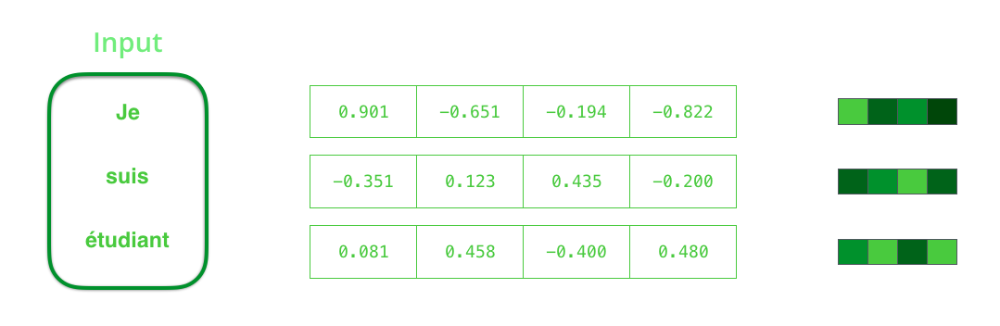
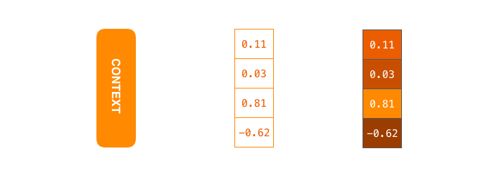
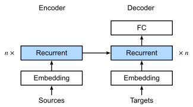
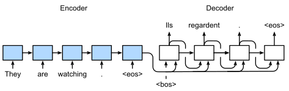

# Encoder-Decoder Architecture (Seq2Seq) — 2014

---

## The Two Landmark Papers

Two papers published in 2014 independently proposed and refined the Encoder-Decoder (Seq2Seq) framework:

| Paper | Authors | Contribution |
|---|---|---|
| *Learning Phrase Representations using RNN Encoder–Decoder for Statistical Machine Translation* | Cho et al. (2014) | Introduced the RNN Encoder-Decoder and GRU |
| *Sequence to Sequence Learning with Neural Networks* | Sutskever, Vinyals & Le (2014, Google Brain) | Scaled the idea with LSTMs; reversed input sequence trick |

Both tackled the same core challenge: **how to map a variable-length input sequence to a variable-length output sequence** — something vanilla RNNs couldn't cleanly do.

---

## The Core Problem

Standard RNNs process sequences step-by-step and produce one output per input step. But in machine translation, the input and output sentences are different lengths and don't align word-by-word:

```
Input  (French): "Je  ne  suis  pas  le  chat  noir"   → 7 tokens
Output (English): "I  am  not  the  black  cat"         → 6 tokens
```

There's no clean 1-to-1 correspondence. You need a model that:
1. **Reads** the entire input sentence and builds an understanding of it.
2. **Generates** the output sentence word-by-word from that understanding.

This is exactly what the Encoder-Decoder solves.

---

## High-Level Architecture


*Fig 1: The Encoder (left) reads the source tokens and produces a context vector `c`. The Decoder (right) consumes `c` and generates target tokens one at a time. `<eos>` marks end-of-sequence.*

The model is split into two distinct RNNs:

```
Input Sequence  ─►  [ ENCODER RNN ]  ──► context vector c ──►  [ DECODER RNN ]  ─►  Output Sequence
```

---

## Step 1 — The Encoder

The encoder is an RNN (LSTM or GRU) that reads the input sequence token by token.



*Fig 2: Words are first converted to dense embedding vectors before being fed to the encoder.*

At each time step `t`, the encoder computes a hidden state:

$$h_t = f(x_t,\ h_{t-1})$$

where:
- `x_t` is the embedding of the t-th input token
- `h_{t-1}` is the previous hidden state
- `f` is the RNN cell (LSTM or GRU)

The encoder runs through all `T` tokens and produces hidden states `h_1, h_2, ..., h_T`.

> **Key insight:** The encoder does NOT produce output at each step. Its job is purely to accumulate information from the full input sequence.

---

## Step 2 — The Context Vector

After processing all input tokens, the encoder outputs a single **context vector** `c`:

$$c = q(h_1, h_2, \ldots, h_T)$$

In both 2014 papers, `q` simply takes the **last hidden state**:

$$c = h_T$$



*Fig 3: The context vector is a fixed-size floating-point vector (typically 256–1024 dimensions) that encodes the entire meaning of the input sentence. It acts as a compressed "thought vector."*

This single vector is the bridge between the encoder and decoder — it carries the full semantic content of the source sentence.

---

## Step 3 — The Decoder

The decoder is another RNN that generates the output sequence one token at a time, conditioned on:
1. The **context vector `c`** from the encoder
2. Its own **previous hidden state** `s_{t-1}`
3. The **previously generated token** `y_{t-1}`

$$s_t = g(y_{t-1},\ s_{t-1},\ c)$$

$$P(y_t \mid y_1, \ldots, y_{t-1},\ c) = \text{softmax}(W \cdot s_t)$$

The decoder starts with `c` as its initial hidden state and a special `<sos>` (start-of-sequence) token as its first input. It generates tokens until it produces `<eos>` (end-of-sequence).

---

## Detailed Architecture



*Fig 4: Detailed view showing how the encoder hidden states are computed and how the final context vector initializes the decoder. The embedding layers, RNN layers, and dense output layers are all visible here.*

### Key differences between the two 2014 papers:

| | Cho et al. 2014 | Sutskever et al. 2014 |
|---|---|---|
| RNN Cell | GRU (which they invented!) | 4-layer deep LSTM |
| Input order | Normal left-to-right | **Reversed** (trick to reduce gradient path) |
| Context init | Decoder initial state = c | Same |
| Depth | Shallow (1 layer) | Deep (4 stacked layers) |

> **Sutskever's reversal trick:** They fed the source sentence in *reverse order* to the encoder. "I like cats" → encoder sees "cats like I". This reduced the distance between matching source and target words, making gradients flow better.

---

## Training — Teacher Forcing

During training, instead of feeding the decoder's own predictions back as input, we feed the **ground-truth target tokens**. This is called **Teacher Forcing**:

```
Target:      <sos>  "I"    "am"   "not"  "the"  "black" "cat"  <eos>
             ↓      ↓      ↓      ↓      ↓      ↓       ↓
Decoder:  [step1] [step2] [step3] [step4] [step5] [step6] [step7]
Predicts:  "I"    "am"   "not"  "the"  "black" "cat"  <eos>
```

**Without teacher forcing**, early prediction errors cascade and make training very unstable. Teacher forcing stabilizes the training by always giving the correct previous token.

**Loss function** — cross-entropy averaged over all target tokens:

$$\mathcal{L} = -\frac{1}{T'} \sum_{t=1}^{T'} \log P(y_t^* \mid y_1^*, \ldots, y_{t-1}^*,\ c)$$

where `y*` are the ground-truth tokens and `T'` is the target sequence length.

---

## Inference — Greedy Decoding

At inference time, teacher forcing is no longer possible (no ground truth). The decoder auto-regressively feeds its own predictions:



*Fig 5: At inference, the decoder uses its own output token from step t as input to step t+1, continuing until `<eos>` is produced.*

Two strategies:
1. **Greedy Decoding** — pick the highest probability token at each step. Fast but suboptimal.
2. **Beam Search** — keep top-k candidate sequences at each step. Sutskever et al. used beam size = 2 for their best results.

---

## Full Forward Pass — Visualized

```
SOURCE: "Je suis étudiant"

ENCODER:
  "Je"       → h_1
  "suis"     → h_2
  "étudiant" → h_3 = c  ← context vector

DECODER (with teacher forcing during training):
  <sos> + c  → s_1  → "I"
  "I"   + s_1 → s_2 → "am"
  "am"  + s_2 → s_3 → "a"
  "a"   + s_3 → s_4 → "student"
  "student" + s_4 → s_5 → <eos>  ✓ STOP
  
OUTPUT: "I am a student"
```

---

## Mathematical Summary

| Symbol | Meaning |
|---|---|
| `x_1, ..., x_T` | Source tokens (embedded) |
| `h_t` | Encoder hidden state at step t |
| `c = h_T` | Context vector (bottleneck) |
| `y_1, ..., y_{T'}` | Target tokens |
| `s_t` | Decoder hidden state at step t |
| `<sos>` | Start-of-sequence token |
| `<eos>` | End-of-sequence token |

**Encoder:**
$$h_t = \text{RNN}_{\text{enc}}(x_t, h_{t-1}), \quad h_0 = \mathbf{0}$$

**Context:**
$$c = h_T$$

**Decoder:**
$$s_t = \text{RNN}_{\text{dec}}(y_{t-1}, s_{t-1}, c), \quad s_0 = c$$

**Output:**
$$\hat{y}_t = \text{softmax}(W_o \cdot s_t + b_o)$$

---

## The Bottleneck Problem

The fundamental weakness of the 2014 architecture is forcing the **entire input sentence into a single fixed-size vector `c`**:

```
"The animal didn't cross the street because it was too tired"
→  compressed into → [ 0.23, -0.87, 1.02, ..., 0.55 ]  (512 numbers)
→  decoder must recover full meaning from this alone
```

For long sentences, the context vector simply doesn't have enough capacity. Performance degrades significantly as sentence length increases:

```
BLEU Score vs. Input Length:
Length  5-9  : ████████████████████  ~35 BLEU
Length 10-19 : ███████████████       ~28 BLEU
Length 20-29 : █████████             ~21 BLEU
Length 30+   : ████                  ~15 BLEU  ← degradation
```

> This was a known limitation even in the original 2014 papers. Sutskever et al. noted that the model "struggles with long sentences."

---

## Impact and What Came Next

### Results at the time (2014)

Sutskever et al. achieved **34.8 BLEU** on English→French translation using only this simple architecture — competitive with heavily engineered statistical MT systems of the era.

### The Legacy

The 2014 Encoder-Decoder became the foundation for:

```
Encoder-Decoder (2014)
        ↓
+ Attention Mechanism (Bahdanau et al., 2015)
        ↓
+ Multi-Head Self-Attention
        ↓
Transformer Architecture (Vaswani et al., 2017)
        ↓
BERT, GPT, T5, ... (2018–present)
```

The attention mechanism (2015) directly solved the bottleneck problem by allowing the decoder to "look back" at **all** encoder hidden states instead of just the final `c`.

---

## Applications of Seq2Seq (2014 Architecture)

| Task | Input | Output |
|---|---|---|
| Machine Translation | English sentence | French sentence |
| Text Summarization | Long article | Short summary |
| Question Answering | Question + context | Answer |
| Speech Recognition | Audio features | Text transcript |
| Image Captioning | CNN image features | Caption |
| Code Generation | Natural language | Code |
| Chatbot | User utterance | Response |

---

## Key Takeaways

1. **Two RNNs** — one to encode, one to decode. Completely separate weights.
2. **Context vector** — the single fixed-size "thought vector" connecting them.
3. **Variable-length I/O** — the architecture naturally handles different input and output lengths.
4. **Teacher forcing** — use ground truth tokens during training, not predictions.
5. **Bottleneck** — the context vector is the core limitation; attention was the fix.
6. **GRU was born here** — Cho et al. introduced the GRU cell in the same paper.

---

## Further Reading & Resources

- [Original Cho et al. 2014 Paper (arXiv)](https://arxiv.org/abs/1406.1078)
- [Original Sutskever et al. 2014 Paper (arXiv)](https://arxiv.org/abs/1409.3215)
- [Jay Alammar — Visualizing Seq2Seq with Attention (animations)](https://jalammar.github.io/visualizing-neural-machine-translation-mechanics-of-seq2seq-models-with-attention/)
- [Dive into Deep Learning — Seq2Seq Chapter](https://d2l.ai/chapter_recurrent-modern/seq2seq.html)
- [Bahdanau Attention Paper (2015) — the fix to the bottleneck](https://arxiv.org/abs/1409.0473)
