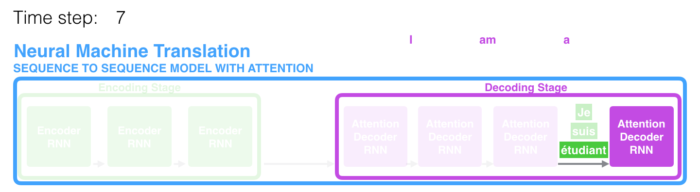
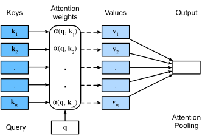
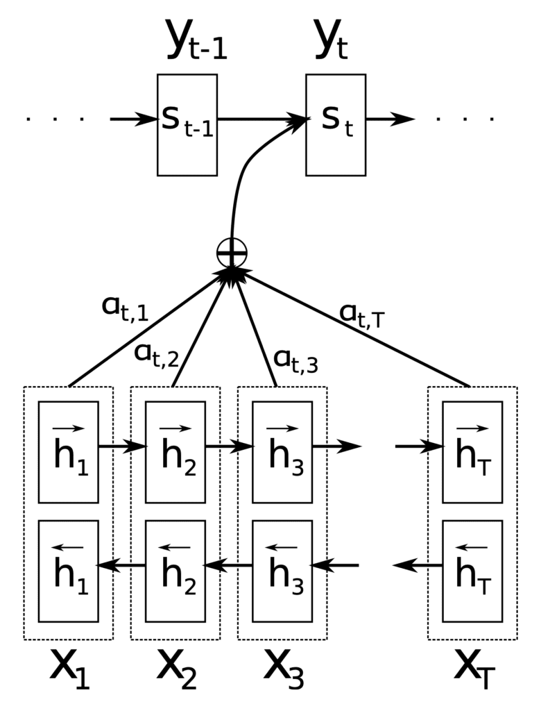
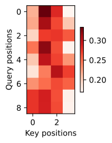
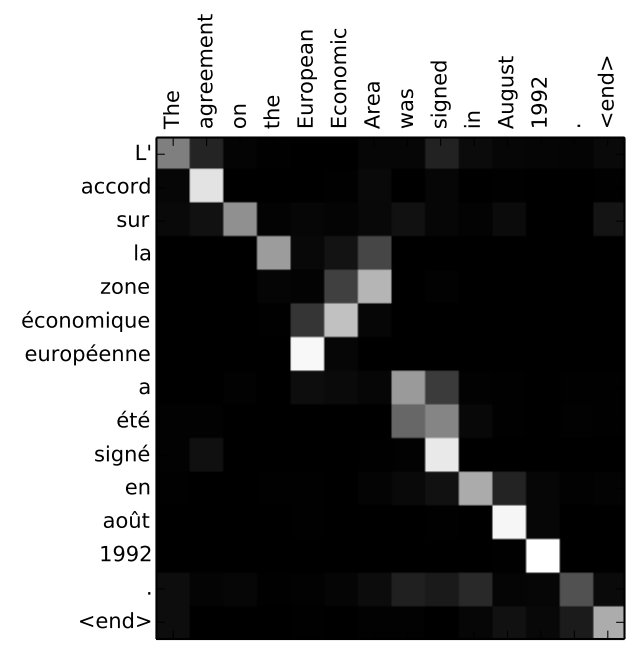
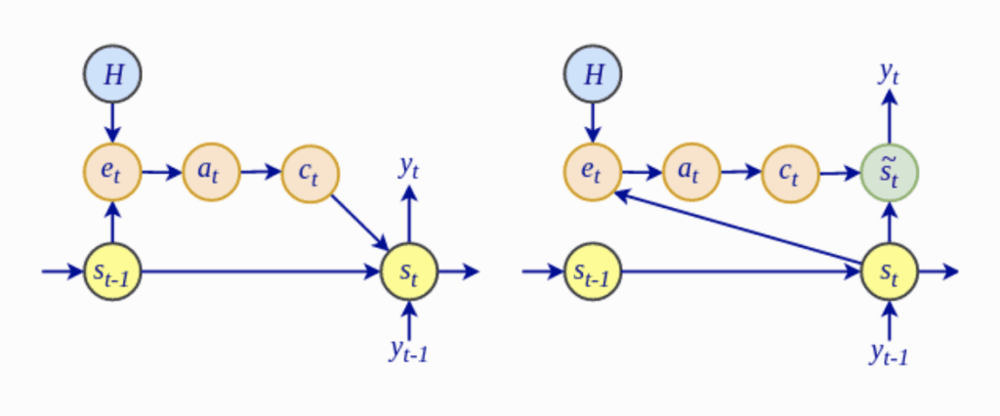
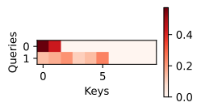
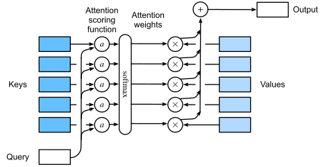

# Attention Mechanism — Bahdanau (2015) & Luong (2015)

---

## The Problem Attention Solves

The 2014 Encoder-Decoder architecture had a fundamental flaw: every source sentence, regardless of length, was crammed into a **single fixed-size context vector** `c = h_T`.

```
"The European Economic Area agreement was signed in August 1992"
             → [ 0.23, -0.87, 1.02, ..., 0.55 ]   ← 512 numbers to carry ALL of this
             → decoder must reconstruct meaning from this alone
```

Performance collapsed on long sentences. The model had no way to "go back and look" at specific parts of the input when generating each output word.

> **Core insight of attention:** When translating the word "European", the decoder should be able to re-read the encoder's representation of "European" in the source — not just trust a compressed summary.

---

## The Big Idea: Dynamic Context

Instead of a single static context vector, attention computes a **fresh, weighted combination of all encoder hidden states** at every decoder step:



*Fig 1: At each decoding step, the model computes a different weighted blend of the encoder's hidden states. Steps generating "European" attend heavily to the corresponding encoder position; steps generating "1992" attend to the number position. (Source: Jay Alammar)*

```
No attention:    decoder step t  ←  c  (same static vector always)

With attention:  decoder step t  ←  c_t  (fresh weighted sum, different every step)
```

---

## General Framework: Queries, Keys, and Values

Before diving into specific papers, here is the unified framework that all attention mechanisms fit into:



*Fig 2: The general attention framework. A query attends over key-value pairs to produce a weighted output. (Source: d2l.ai)*

| Component | What it is | In Seq2Seq Attention |
|---|---|---|
| **Query** `q` | What we're looking for | Decoder hidden state `s_{t-1}` |
| **Keys** `k_i` | What we compare against | Encoder hidden states `h_i` |
| **Values** `v_i` | What we retrieve | Also encoder hidden states `h_i` |
| **Score** `e_i` | Compatibility of `q` with `k_i` | Raw alignment score |
| **Weights** `α_i` | Softmaxed scores | How much to attend to position `i` |
| **Context** `c_t` | Weighted sum of values | Dynamic context for decoder step `t` |

The general computation is always:

$$e_i = \text{score}(q,\ k_i)$$

$$\alpha_i = \frac{\exp(e_i)}{\sum_j \exp(e_j)} \quad \leftarrow \text{softmax over all positions}$$

$$c = \sum_i \alpha_i \cdot v_i \quad \leftarrow \text{weighted sum of values}$$

The **only thing that differs** between attention variants is the `score()` function.

---

## Part 1 — Bahdanau Attention (2015)

**Paper:** *Neural Machine Translation by Jointly Learning to Align and Translate*  
**Authors:** Dzmitry Bahdanau, Kyunghyun Cho, Yoshua Bengio  
**Also called:** Additive Attention, Concat Attention

### The Architecture



*Fig 3: The Bahdanau attention architecture. Bottom: the **bidirectional RNN encoder** — forward states →h and backward states ←h are stacked at each position. Middle: attention weights a_{t,1}…a_{t,T} are summed (⊕) to form the dynamic context. Top: decoder states s_{t-1} → s_t. (Source: Bahdanau et al. 2015 via MachineLearningMastery)*

Bahdanau made two key architectural changes:
1. **Bidirectional Encoder** — the encoder uses a BiRNN, so each `h_i` captures context from both directions.
2. **Attention at every decoder step** — `c_t` is recomputed each time the decoder generates a word.

### How It Works — Step by Step

```
ENCODER (BiRNN):
  Forward  RNN: x_1 → x_2 → ... → x_T    produces  →h_1, →h_2, ..., →h_T
  Backward RNN: x_T → x_{T-1} → ... → x_1 produces  ←h_T, ←h_{T-1}, ..., ←h_1

  Concatenate at each position:  h_i = [→h_i ; ←h_i]   ← bidirectional annotation

DECODER STEP t:
  1. Have previous decoder state s_{t-1}
  2. Compute alignment score with EVERY encoder state:
       e_{t,i} = score(s_{t-1}, h_i)   for i = 1..T
  3. Softmax to get attention weights:
       α_{t,i} = softmax(e_{t,i})       sums to 1
  4. Compute context vector:
       c_t = Σ_i α_{t,i} · h_i
  5. Update decoder state using context:
       s_t = f(s_{t-1}, y_{t-1}, c_t)
  6. Output:
       y_t = softmax(W · s_t)
```

### The Score Function (Alignment Model)

Bahdanau's score is computed by a small **feedforward neural network** (a learned alignment model `a`):

$$e_{t,i} = v_a^\top \tanh\!\bigl(W_a s_{t-1} + U_a h_i\bigr)$$

Where:
- `s_{t-1}` — previous decoder hidden state (the **query**)
- `h_i` — encoder annotation at position `i` (the **key**)
- `W_a`, `U_a` — learned weight matrices
- `v_a` — learned weight vector (projects to a scalar)

This is called **additive attention** because the query and key are combined by *addition* (after a linear transformation) before passing through `tanh`.

> The score function is trained *jointly* with the rest of the translation model — end-to-end. There is no separate supervised training signal for attention.

### Full Mathematical Formulation

**Encoder (BiRNN):**
$$\vec{h}_i = \text{RNN}_{\text{fwd}}(x_i,\ \vec{h}_{i-1}), \quad \overleftarrow{h}_i = \text{RNN}_{\text{bwd}}(x_i,\ \overleftarrow{h}_{i+1})$$
$$h_i = [\vec{h}_i\, ;\, \overleftarrow{h}_i]$$

**Attention Score:**
$$e_{t,i} = v_a^\top \tanh(W_a s_{t-1} + U_a h_i)$$

**Attention Weights (Alignment):**
$$\alpha_{t,i} = \frac{\exp(e_{t,i})}{\sum_{j=1}^{T} \exp(e_{t,j})}$$

**Context Vector:**
$$c_t = \sum_{i=1}^{T} \alpha_{t,i} \cdot h_i$$

**Decoder Update:**
$$s_t = \text{GRU}(y_{t-1},\ s_{t-1},\ c_t)$$

**Output Distribution:**
$$P(y_t \mid y_{<t}, x) = \text{softmax}(W_o \cdot s_t + b_o)$$

### The Alignment Matrix — Visualized



*Fig 4: A learned attention weight matrix α_{t,i}. Each row is one decoder step; each column is one encoder position. Brighter cells = higher attention weight. The model discovers soft word alignments with no explicit supervision — e.g. the output word "agreement" attends strongly to the source word "l'accord". (Source: d2l.ai)*

This matrix reveals what the model "looks at" when generating each output word — an emergent soft alignment that was never explicitly supervised.



*Fig 5: Attention visualized as a heatmap over source words at each decoding step. The decoder can attend to any source position, not just the end. (Source: Jay Alammar)*

### Computational Cost

At each decoder step `t`, Bahdanau attention computes `T` alignment scores (one per encoder position). The total cost over `T'` decoder steps is:

$$\mathcal{O}(T \times T')$$

For long sequences this is expensive, which motivated Luong's local attention variant.

---

## Part 2 — Luong Attention (2015)

**Paper:** *Effective Approaches to Attention-based Neural Machine Translation*  
**Authors:** Minh-Thang Luong, Hieu Pham, Christopher D. Manning  
**Also called:** Multiplicative Attention

Luong et al. made attention *simpler* and explored multiple score functions. They also introduced **local attention** to handle long sequences efficiently.

### Architecture Differences from Bahdanau



*Fig 6: Luong attention differences vs. Bahdanau. Key change: the attention context is computed *after* the decoder RNN step (not before), using the current decoder state `h_t` rather than the previous `s_{t-1}`. (Source: MachineLearningMastery)*

| | Bahdanau (2015) | Luong (2015) |
|---|---|---|
| Encoder | Bidirectional RNN | Unidirectional (stacked) LSTM |
| Query for attention | Previous state `s_{t-1}` | Current state `h_t` |
| When context computed | **Before** decoder step | **After** decoder step |
| Score function | Additive (MLP) | Dot, General, or Concat |
| Coverage | All positions (global) | **Global** or **Local** |
| Complexity (score) | `O(T × d)` | `O(d²)` or `O(d)` |

### Global Attention

In global attention, the decoder attends over **all** encoder hidden states at every step — same philosophy as Bahdanau, but with simpler score functions.

```
DECODER STEP t:
  1. Run decoder RNN → get h_t  (current state, used as query)
  2. Score against all encoder states:
       e_{t,i} = score(h_t, h̄_i)   for i = 1..T
  3. α_{t,i} = softmax(e_{t,i})
  4. c_t = Σ_i α_{t,i} · h̄_i
  5. ã_t = tanh(W_c [c_t ; h_t])     ← attentional hidden state
  6. y_t = softmax(W_s · ã_t)
```

### Three Score Functions

Luong compared three ways to compute the alignment score:

$$\text{score}(h_t, \bar{h}_i) = \begin{cases} h_t^\top \bar{h}_i & \text{dot} \\ h_t^\top W_a \bar{h}_i & \text{general} \\ v_a^\top \tanh(W_a [h_t\, ;\, \bar{h}_i]) & \text{concat (≈ Bahdanau)} \end{cases}$$

| Score | Parameters | Cost | Notes |
|---|---|---|---|
| **dot** | None | `O(d)` | Only works if encoder/decoder have same dimension |
| **general** | `W_a ∈ ℝ^{d×d}` | `O(d²)` | Works across different dimensions |
| **concat** | `W_a, v_a` | `O(d)` | Equivalent to Bahdanau; slightly slower |

> Luong's experiments found **dot** and **general** often outperformed **concat**, despite being simpler. The expressive MLP in Bahdanau wasn't necessary.

### Local Attention

Global attention is expensive for long documents — it attends over *all* `T` positions at every step. Luong introduced **local attention** which attends to a *window* around a predicted position:

```
Global:  attend over positions {1, 2, ..., T}     always
Local:   attend over positions {p_t - D, ..., p_t + D}  (2D+1 positions)
```

**Step 1 — Predict aligned position** `p_t`:

$$p_t = S \cdot \text{sigmoid}(v_p^\top \tanh(W_p h_t))$$

where `S` is the source sentence length. This predicts which source position to center the window on.

**Step 2 — Gaussian centering:**  
Apply a Gaussian distribution around `p_t` so positions closer to `p_t` get more weight even before softmax:

$$\alpha_{t,i} = \text{softmax}(e_{t,i}) \cdot \exp\!\left(-\frac{(i - p_t)^2}{2\sigma^2}\right)$$

where `σ = D/2`. This means positions far from `p_t` are down-weighted even if the raw score `e_{t,i}` is high.

**Two variants:**
- **Monotonic (local-m):** `p_t = t` (assume monotonic alignment, no prediction)
- **Predictive (local-p):** `p_t` is learned as above

The window size `D` is a hyperparameter. Luong used `D = 10`.

```
Comparison of Attention Coverage:

Global:  ■ ■ ■ ■ ■ ■ ■ ■ ■ ■ ■ ■ ■ ■ ■ ■ ■ ■ ■ ■  (all T positions)
Local:               ■ ■ ■ ■ ■ ■ ■              (2D+1 window around p_t)
```

### The Attentional Hidden State

After computing `c_t`, Luong concatenates it with `h_t` and passes through a `tanh` layer to get the **attentional hidden state** `ã_t`:

$$\tilde{h}_t = \tanh(W_c\, [c_t\, ;\, h_t])$$

$$P(y_t \mid y_{<t}, x) = \text{softmax}(W_s\, \tilde{h}_t)$$

This final `ã_t` is also fed as input to the decoder at the next step (called **input feeding**), giving the model memory of past attention decisions.

### Input Feeding

Luong introduced the concept of **input feeding**: the attentional hidden state `ã_{t-1}` is concatenated with the decoder's input at the next step.

```
Without input feeding:  x_t  ──→ [RNN] → h_t
With input feeding:  [x_t ; ã_{t-1}]  ──→ [RNN] → h_t
```

This allows the model's attention at step `t` to be informed by what it attended to at step `t-1` — capturing monotonicity and coverage implicitly.

---

## The Attention Heatmap



*Fig 7: Attention scoring heatmap comparing Gaussian (left) vs. dot-product (right) kernels. The Gaussian kernel produces smooth, localized attention while dot-product attention can be sharper and more peaked. Both show the same "which position gets how much weight" concept at the core of every attention mechanism. (Source: d2l.ai)*



*Fig 8: The attention pooling mechanism — weighted sum of value vectors (encoder hidden states) using learned attention weights. This is the core computation that both Bahdanau and Luong share. (Source: d2l.ai)*

---

## Bahdanau vs. Luong — Full Comparison

| Aspect | Bahdanau (2015) | Luong (2015) |
|---|---|---|
| **Paper** | "Neural MT by Jointly Learning to Align and Translate" | "Effective Approaches to Attention-based NMT" |
| **Encoder** | Bidirectional GRU | Multi-layer LSTM (unidirectional) |
| **Query** | Previous decoder state `s_{t-1}` | Current decoder state `h_t` |
| **Context computed** | Before decoder step (top-down) | After decoder step (bottom-up) |
| **Score function** | Additive: `v^T tanh(W·s + U·h)` | Dot / General / Concat |
| **Output** | Direct from `s_t` | Attentional state `ã_t = tanh(W_c [c;h])` |
| **Coverage** | Global only | Global or **Local** (window) |
| **Input feeding** | No | Yes |
| **Complexity** | Higher (MLP per pair) | Lower (dot/general) |
| **When to use** | Strong alignment tasks, shorter seqs | Long sequences, efficiency matters |

### Score Function: Additive vs. Multiplicative

```
ADDITIVE (Bahdanau):
  e = v^T · tanh(W_1 · query + W_2 · key)
  ↑ Passes through a tanh non-linearity — more expressive
  ↑ Two separate matrix projections, then add
  ↓ Slower: O(d) multiplications per pair, plus non-linearity

MULTIPLICATIVE (Luong dot/general):
  e = query^T · key                      ← dot
  e = query^T · W · key                  ← general
  ↑ No non-linearity — simpler
  ↑ Faster: just a dot product
  ↓ Can have large variance for high-dimensional vectors (fix: scale by 1/√d)
```

> The scaled dot-product attention used in Transformers is `score = (Q · K^T) / √d_k` — a direct descendant of Luong's multiplicative attention, with the scaling factor added.

---

## PyTorch Implementation

### Bahdanau Attention

```python
import torch
import torch.nn as nn
import torch.nn.functional as F

class BahdanauAttention(nn.Module):
    """
    Additive attention from Bahdanau et al. (2015).
    score(s_{t-1}, h_i) = v^T · tanh(W_a·s + U_a·h)
    """
    def __init__(self, query_dim, key_dim, hidden_dim):
        super().__init__()
        self.W_a = nn.Linear(query_dim, hidden_dim, bias=False)
        self.U_a = nn.Linear(key_dim, hidden_dim, bias=False)
        self.v_a = nn.Linear(hidden_dim, 1, bias=False)

    def forward(self, query, keys, mask=None):
        """
        query : (batch, query_dim)      ← decoder state s_{t-1}
        keys  : (batch, T, key_dim)     ← encoder hidden states h_1..h_T
        mask  : (batch, T) bool         ← True for padding positions
        """
        # Expand query to (batch, T, query_dim)
        query_exp = query.unsqueeze(1).expand_as(keys)  # (batch, T, query_dim)

        # Compute energy scores: (batch, T, hidden_dim) → (batch, T, 1) → (batch, T)
        energy = self.v_a(torch.tanh(self.W_a(query_exp) + self.U_a(keys))).squeeze(-1)

        # Mask padding positions (set to -inf so softmax gives ~0)
        if mask is not None:
            energy = energy.masked_fill(mask, float('-inf'))

        # Softmax over T → attention weights α
        alpha = F.softmax(energy, dim=-1)   # (batch, T)

        # Weighted sum of values (context vector)
        context = torch.bmm(alpha.unsqueeze(1), keys).squeeze(1)  # (batch, key_dim)

        return context, alpha
```

### Luong Global Attention (dot / general / concat)

```python
class LuongAttention(nn.Module):
    """
    Luong et al. (2015) global attention.
    Three score variants: 'dot', 'general', 'concat'
    """
    def __init__(self, hidden_dim, score='general'):
        super().__init__()
        self.score_type = score
        if score == 'general':
            self.W_a = nn.Linear(hidden_dim, hidden_dim, bias=False)
        elif score == 'concat':
            self.W_a = nn.Linear(hidden_dim * 2, hidden_dim, bias=False)
            self.v_a = nn.Linear(hidden_dim, 1, bias=False)
        # 'dot' needs no parameters

    def forward(self, h_t, encoder_states, mask=None):
        """
        h_t            : (batch, hidden_dim)     ← current decoder state
        encoder_states : (batch, T, hidden_dim)  ← encoder hidden states
        """
        if self.score_type == 'dot':
            # e_i = h_t^T · h̄_i
            energy = torch.bmm(
                encoder_states,
                h_t.unsqueeze(-1)
            ).squeeze(-1)                              # (batch, T)

        elif self.score_type == 'general':
            # e_i = h_t^T · W_a · h̄_i
            energy = torch.bmm(
                encoder_states,
                self.W_a(h_t).unsqueeze(-1)
            ).squeeze(-1)                              # (batch, T)

        elif self.score_type == 'concat':
            # e_i = v^T · tanh(W_a · [h_t ; h̄_i])
            h_t_exp = h_t.unsqueeze(1).expand_as(encoder_states)
            energy = self.v_a(
                torch.tanh(self.W_a(torch.cat([h_t_exp, encoder_states], dim=-1)))
            ).squeeze(-1)

        if mask is not None:
            energy = energy.masked_fill(mask, float('-inf'))

        alpha = F.softmax(energy, dim=-1)              # (batch, T)
        context = torch.bmm(alpha.unsqueeze(1), encoder_states).squeeze(1)

        # Luong attentional hidden state: ã_t = tanh(W_c [c_t ; h_t])
        attn_hidden = torch.tanh(
            torch.cat([context, h_t], dim=-1)
        )
        # In practice, W_c is applied here — omitted for brevity

        return context, alpha, attn_hidden
```

### Complete Attention Decoder Step

```python
class AttentionDecoder(nn.Module):
    """
    Single step of Luong-style attention decoder with input feeding.
    """
    def __init__(self, embed_dim, hidden_dim, vocab_size, score='general'):
        super().__init__()
        # Input feeding: concat embedding with previous attentional state
        self.rnn = nn.GRU(embed_dim + hidden_dim, hidden_dim, batch_first=True)
        self.attention = LuongAttention(hidden_dim, score)
        self.W_c = nn.Linear(hidden_dim * 2, hidden_dim)
        self.output_proj = nn.Linear(hidden_dim, vocab_size)

    def forward(self, y_prev_embed, h_prev, attn_prev, encoder_states, mask=None):
        """
        y_prev_embed : (batch, embed_dim)    ← embedding of previous output token
        h_prev       : (1, batch, hidden)    ← previous decoder hidden state
        attn_prev    : (batch, hidden)       ← previous attentional hidden state (input feeding)
        encoder_states: (batch, T, hidden)
        """
        # Input feeding: concatenate with previous attentional state
        rnn_input = torch.cat([y_prev_embed, attn_prev], dim=-1).unsqueeze(1)

        # Step RNN
        _, h_t = self.rnn(rnn_input, h_prev)     # h_t: (1, batch, hidden)
        h_t_squeezed = h_t.squeeze(0)            # (batch, hidden)

        # Compute attention using CURRENT h_t (Luong's way)
        context, alpha, _ = self.attention(h_t_squeezed, encoder_states, mask)

        # Attentional hidden state
        attn_hidden = torch.tanh(
            self.W_c(torch.cat([context, h_t_squeezed], dim=-1))
        )

        # Output distribution
        logits = self.output_proj(attn_hidden)
        return logits, h_t, attn_hidden, alpha
```

---

## Why Attention Was Revolutionary

### 1. Solved the Bottleneck

```
Before attention:
  Source → h_1 h_2 h_3 ... h_T → c → Decoder
                                  ↑
                         (single vector must carry everything)

After attention:
  Source → h_1 h_2 h_3 ... h_T
             ↕   ↕   ↕       ↕
           α_1 α_2 α_3 ... α_T  (learned per decoder step)
             ↘   ↘   ↘       ↘
                   c_t  (dynamic, step-specific)
```

### 2. Free Interpretability

The attention weights `α_{t,i}` give you a soft alignment between source and target — for free, with no alignment annotation during training.

### 3. Gradient Highways

Without attention, gradients from the decoder's loss had to flow all the way through the fixed context vector back to early encoder states. With attention:

```
Decoder step t  ←──── gradient ────→ encoder state h_i
                  (direct path via α_{t,i})
```

Attention creates **direct gradient paths** from every decoder step to every encoder step, greatly alleviating vanishing gradients.

### 4. The Path to Transformers

```
Bahdanau Attention (2015)
        ↓  Simplified score function, local attention
Luong Attention (2015)
        ↓  Remove the RNN entirely, use attention for everything
Self-Attention / Transformer (Vaswani et al., 2017)
        ↓  Scale up
BERT, GPT, T5, ... (2018–present)
```

Luong's scaled-dot-product score directly inspired the Transformer's attention:

$$\text{Attention}(Q, K, V) = \text{softmax}\!\left(\frac{QK^\top}{\sqrt{d_k}}\right) V$$

---

## Key Takeaways

| | Bahdanau | Luong |
|---|---|---|
| Year | 2015 (Jan) | 2015 (Aug) |
| Score | Additive (MLP) | Multiplicative (dot/general) |
| Query | `s_{t-1}` (prev state) | `h_t` (current state) |
| Encoder | BiRNN | Stacked LSTM |
| Local Attention | No | Yes |
| Input Feeding | No | Yes |

1. **Attention replaces the fixed bottleneck** with a dynamic, step-specific context vector.
2. **Bahdanau** introduced the concept: soft alignment learned jointly with translation.
3. **Luong** refined it: simpler scores, local window, input feeding, attentional hidden state.
4. **Both are O(T × T')** total cost — this quadratic scaling eventually motivated Transformers.
5. **Attention weights are interpretable** — they reveal what the model looks at.
6. **Scaled dot-product** (Luong → Transformer) is now the dominant formulation.

---

## Further Reading & Resources

- [Bahdanau et al. 2015 — Original Attention Paper (arXiv)](https://arxiv.org/abs/1409.0473)
- [Luong et al. 2015 — Effective Approaches (arXiv)](https://arxiv.org/abs/1508.04025)
- [Jay Alammar — Visualizing Seq2Seq with Attention (animations)](https://jalammar.github.io/visualizing-neural-machine-translation-mechanics-of-seq2seq-models-with-attention/)
- [Lilian Weng — Attention? Attention! (comprehensive survey)](https://lilianweng.github.io/posts/2018-06-24-attention/)
- [Dive into Deep Learning — Bahdanau Attention Chapter](https://d2l.ai/chapter_attention-mechanisms-and-transformers/bahdanau-attention.html)
- [MachineLearningMastery — The Bahdanau Attention Mechanism](https://machinelearningmastery.com/the-bahdanau-attention-mechanism/)
- [MachineLearningMastery — The Luong Attention Mechanism](https://machinelearningmastery.com/the-luong-attention-mechanism/)
- [Vaswani et al. 2017 — Attention Is All You Need (Transformer paper)](https://arxiv.org/abs/1706.03762)
