# Transformers: Attention Is All You Need

> **Paper**: [Attention Is All You Need](https://arxiv.org/abs/1706.03762) — Vaswani et al., 2017  
> **Key Insight**: Replace recurrence and convolution entirely with attention mechanisms.

---

## Table of Contents

1. [Why Transformers?](#1-why-transformers)
2. [High-Level Architecture](#2-high-level-architecture)
3. [Input Embeddings & Tokenization](#3-input-embeddings--tokenization)
4. [Positional Encoding](#4-positional-encoding)
5. [Self-Attention (Scaled Dot-Product Attention)](#5-self-attention-scaled-dot-product-attention)
6. [Multi-Head Attention](#6-multi-head-attention)
7. [The Encoder](#7-the-encoder)
8. [The Decoder](#8-the-decoder)
9. [Feed-Forward Sub-layer](#9-feed-forward-sub-layer)
10. [Residual Connections & Layer Normalization](#10-residual-connections--layer-normalization)
11. [Output: Linear + Softmax](#11-output-linear--softmax)
12. [Training & Loss](#12-training--loss)
13. [Complexity & Parallelism](#13-complexity--parallelism)
14. [Variants & Modern Descendants](#14-variants--modern-descendants)
15. [Summary Cheat-Sheet](#15-summary-cheat-sheet)

---

## 1. Why Transformers?

### Problems with RNNs / LSTMs

| Problem | RNN/LSTM | Transformer |
|---|---|---|
| Sequential computation | Must process token-by-token | Fully parallel |
| Long-range dependencies | Degrades over distance | O(1) path via attention |
| Training speed | Slow (sequential) | Fast (matrix ops) |
| Memory of context | Fixed hidden state | Full sequence attention |

RNNs encode the **entire history** into a single fixed-size hidden state — a bottleneck.  
Transformers look at the **whole sequence simultaneously** through attention.

---

## 2. High-Level Architecture

The Transformer follows an **encoder-decoder** structure originally designed for sequence-to-sequence tasks (e.g., translation).

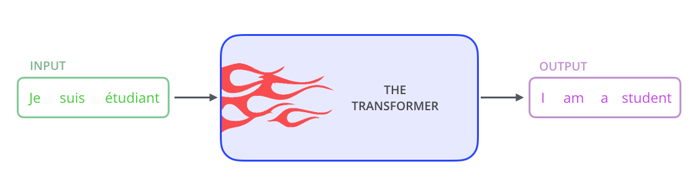

The **encoder** maps an input sequence to a continuous representation.  
The **decoder** generates the output sequence one token at a time, attending to the encoder's output.

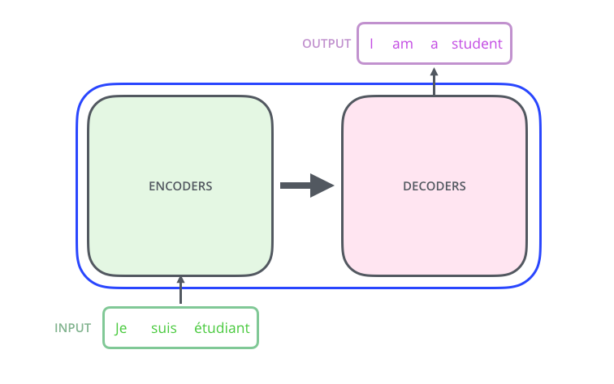

Both encoder and decoder are composed of **stacks of identical layers** (N=6 in the original paper).


### Encoder block (one layer)
- Multi-Head Self-Attention
- Feed-Forward Network
- Each sub-layer wrapped with: **Residual connection** → **Layer Norm**

### Decoder block (one layer)
- Masked Multi-Head Self-Attention
- Cross-Attention (attends to encoder output)
- Feed-Forward Network
- Each sub-layer wrapped with: **Residual connection** → **Layer Norm**

---

## 3. Input Embeddings & Tokenization

Before entering the network, tokens are converted to dense vectors.

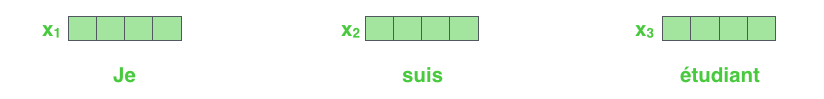

Each token in the vocabulary is mapped to a `d_model`-dimensional vector (512 in the original paper).  
The embedding weights are **learned** during training.

```python
import torch.nn as nn

class TokenEmbedding(nn.Module):
    def __init__(self, vocab_size, d_model):
        super().__init__()
        self.embed = nn.Embedding(vocab_size, d_model)
        self.d_model = d_model

    def forward(self, x):
        # scale by sqrt(d_model) as in the paper
        return self.embed(x) * (self.d_model ** 0.5)
```

The scaling by `√d_model` keeps embedding magnitudes compatible with the positional encodings.

---

## 4. Positional Encoding

Unlike RNNs, Transformers have **no inherent notion of order**. Positional encodings inject position information into the embeddings.


The original paper uses **sinusoidal functions**:

$$PE_{(pos, 2i)} = \sin\!\left(\frac{pos}{10000^{2i/d_{model}}}\right)$$

$$PE_{(pos, 2i+1)} = \cos\!\left(\frac{pos}{10000^{2i/d_{model}}}\right)$$

Where:
- `pos` = position in the sequence (0, 1, 2, …)
- `i` = dimension index
- `d_model` = embedding dimension

Each position gets a unique vector of sine/cosine waves at different frequencies.

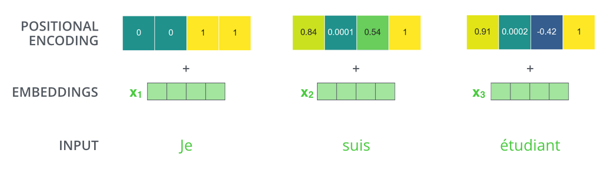

The heatmap below shows the actual encoding values: each row is a position, each column is a dimension.


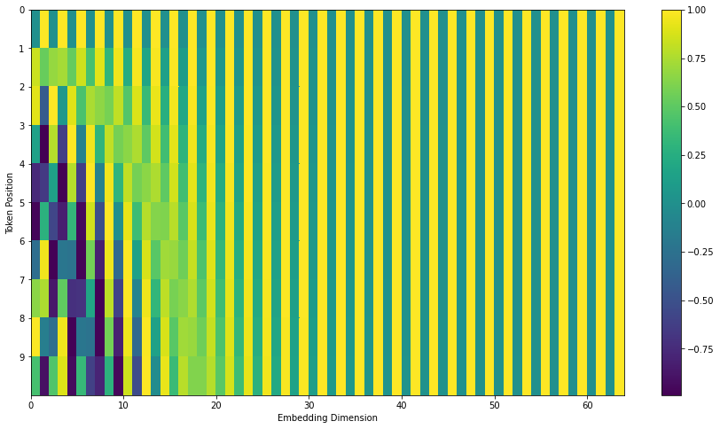

### Why sinusoids?
- **Relative positions** can be represented as linear transformations → the model can generalize to longer sequences than seen during training.
- **Smooth interpolation**: nearby positions have similar encodings.

```python
import math, torch

def positional_encoding(max_len, d_model):
    PE = torch.zeros(max_len, d_model)
    position = torch.arange(0, max_len).unsqueeze(1).float()
    div_term = torch.exp(torch.arange(0, d_model, 2).float() * (-math.log(10000.0) / d_model))
    PE[:, 0::2] = torch.sin(position * div_term)   # even dims
    PE[:, 1::2] = torch.cos(position * div_term)   # odd dims
    return PE  # shape: (max_len, d_model)
```

---

## 5. Self-Attention (Scaled Dot-Product Attention)

This is the **core innovation** of the Transformer. Every token attends to every other token in the sequence.

### Intuition

Consider translating: *"The animal didn't cross the street because **it** was too tired."*  
What does "it" refer to? Self-attention lets the model figure this out by relating "it" to "animal".


### Query, Key, Value

Each token embedding is projected into three vectors:
- **Query (Q)**: "What am I looking for?"
- **Key (K)**: "What do I contain?"
- **Value (V)**: "What do I contribute?"


These projections are learned via weight matrices **W_Q**, **W_K**, **W_V**.

### Computing Attention Step-by-Step

**Step 1** — Compute attention score (dot product of query with each key):


**Step 2** — Scale by `√d_k` (prevents vanishing gradients with large dimensions) and apply softmax:


**Step 3** — Multiply by Value vectors and sum to get the output:

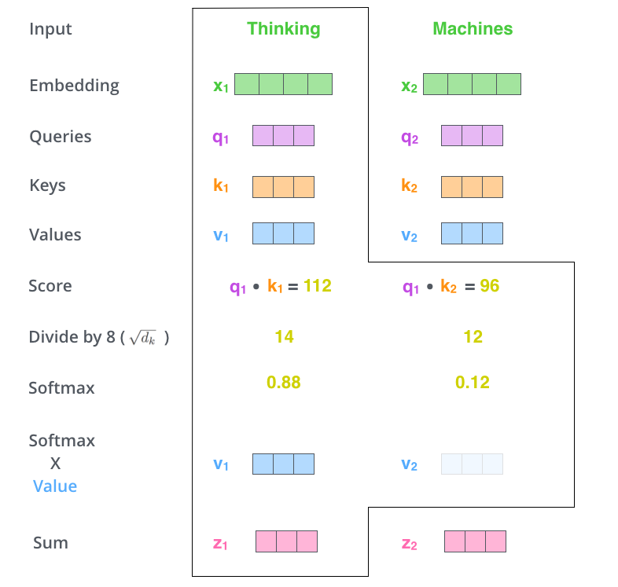

### Matrix Form

In practice, we compute all queries, keys, and values simultaneously as matrices:

$$\text{Attention}(Q, K, V) = \text{softmax}\!\left(\frac{QK^T}{\sqrt{d_k}}\right) V$$


```python
import torch
import torch.nn.functional as F
import math

def scaled_dot_product_attention(Q, K, V, mask=None):
    d_k = Q.size(-1)
    scores = torch.matmul(Q, K.transpose(-2, -1)) / math.sqrt(d_k)
    if mask is not None:
        scores = scores.masked_fill(mask == 0, float('-inf'))
    weights = F.softmax(scores, dim=-1)
    return torch.matmul(weights, V), weights
```

### Why scale by √d_k?

With large `d_k`, dot products grow large → softmax saturates → gradients vanish.  
Dividing by `√d_k` keeps the variance of the dot product ≈ 1.

---

## 6. Multi-Head Attention

Rather than computing a single attention function, the Transformer runs **h parallel attention heads**, each with its own learned projections.


Each head learns to attend to **different aspects** of the sequence (e.g., syntactic vs. semantic relationships).


The outputs from all heads are **concatenated** and projected with W_O:

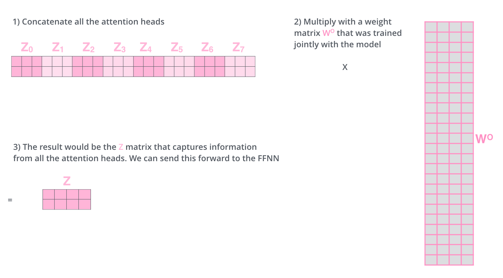

$$\text{MultiHead}(Q, K, V) = \text{Concat}(\text{head}_1, \ldots, \text{head}_h) W^O$$
$$\text{where } \text{head}_i = \text{Attention}(Q W_i^Q,\; K W_i^K,\; V W_i^V)$$

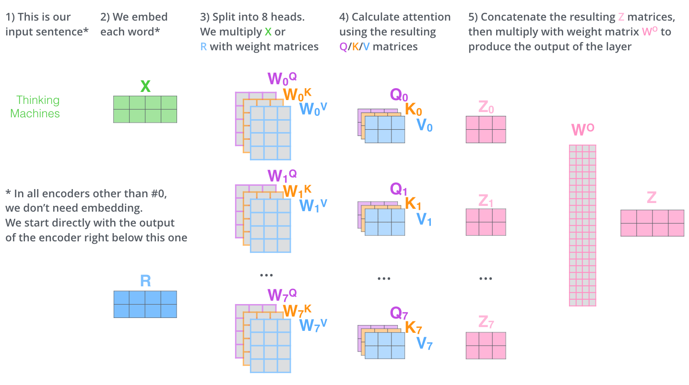

Original paper uses **h = 8 heads**, each with `d_k = d_v = d_model/h = 64`.

### Different heads learn different relationships


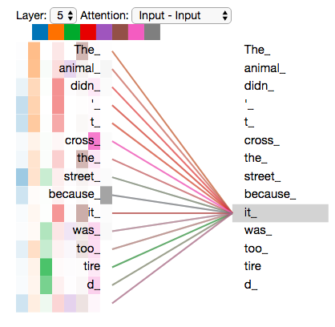

```python
import torch.nn as nn

class MultiHeadAttention(nn.Module):
    def __init__(self, d_model, num_heads):
        super().__init__()
        assert d_model % num_heads == 0
        self.d_k = d_model // num_heads
        self.h = num_heads

        self.W_Q = nn.Linear(d_model, d_model)
        self.W_K = nn.Linear(d_model, d_model)
        self.W_V = nn.Linear(d_model, d_model)
        self.W_O = nn.Linear(d_model, d_model)

    def split_heads(self, x, batch_size):
        # (batch, seq, d_model) -> (batch, heads, seq, d_k)
        x = x.view(batch_size, -1, self.h, self.d_k)
        return x.transpose(1, 2)

    def forward(self, Q, K, V, mask=None):
        B = Q.size(0)
        Q = self.split_heads(self.W_Q(Q), B)
        K = self.split_heads(self.W_K(K), B)
        V = self.split_heads(self.W_V(V), B)

        attn_out, _ = scaled_dot_product_attention(Q, K, V, mask)
        # (batch, heads, seq, d_k) -> (batch, seq, d_model)
        attn_out = attn_out.transpose(1, 2).contiguous().view(B, -1, self.h * self.d_k)
        return self.W_O(attn_out)
```

---

## 7. The Encoder

The encoder processes the **entire input sequence** at once (no masking).


Each encoder layer:
1. **Multi-Head Self-Attention** — every token attends to every other token
2. **Add & Norm** — residual connection + layer normalization
3. **Feed-Forward Network** — position-wise MLP
4. **Add & Norm** — again

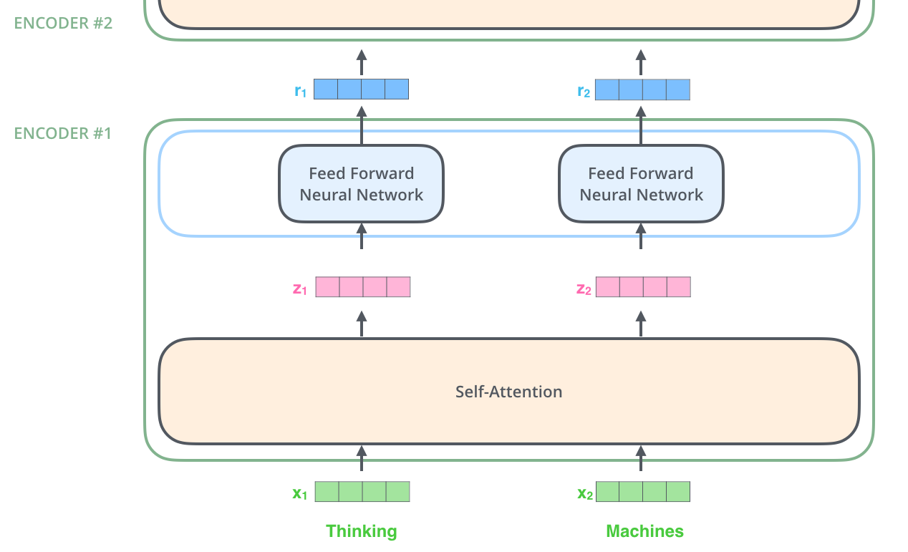

The output of each encoder layer is the **same shape** as the input, so layers stack cleanly.

```python
class EncoderLayer(nn.Module):
    def __init__(self, d_model, num_heads, d_ff, dropout=0.1):
        super().__init__()
        self.self_attn = MultiHeadAttention(d_model, num_heads)
        self.ff = FeedForward(d_model, d_ff)
        self.norm1 = nn.LayerNorm(d_model)
        self.norm2 = nn.LayerNorm(d_model)
        self.drop = nn.Dropout(dropout)

    def forward(self, x, mask=None):
        # Self-attention sub-layer
        x = self.norm1(x + self.drop(self.self_attn(x, x, x, mask)))
        # Feed-forward sub-layer
        x = self.norm2(x + self.drop(self.ff(x)))
        return x
```

---

## 8. The Decoder

The decoder generates output tokens **auto-regressively** (one at a time), attending to both previously generated tokens and the encoder output.


Each decoder layer has **three sub-layers**:

1. **Masked Multi-Head Self-Attention** — attend to previous output tokens only  
   *(masking prevents looking at future tokens — causal mask)*
2. **Cross-Attention (Encoder-Decoder Attention)** — Q comes from decoder, K/V from encoder
3. **Feed-Forward Network**

### Causal (Look-ahead) Mask

During training, we feed the entire target sequence but mask future positions:

```
Position 1 can see: [1]
Position 2 can see: [1, 2]
Position 3 can see: [1, 2, 3]
...
```

```python
def causal_mask(size):
    # Upper triangular matrix of -inf
    mask = torch.triu(torch.ones(size, size), diagonal=1).bool()
    return ~mask  # True = allowed, False = masked
```

### Decoding in Action (GIFs)

The decoder generates one token at a time:

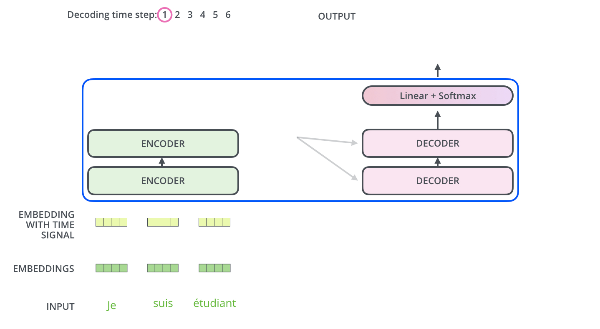


---

## 9. Feed-Forward Sub-layer

Each encoder/decoder layer contains a **position-wise** feed-forward network:

$$\text{FFN}(x) = \max(0,\; xW_1 + b_1)\; W_2 + b_2$$

- Two linear transformations with a ReLU in between
- Applied **independently to each position**
- Inner dimension: `d_ff = 2048` (4× the model dimension)

```python
class FeedForward(nn.Module):
    def __init__(self, d_model, d_ff, dropout=0.1):
        super().__init__()
        self.linear1 = nn.Linear(d_model, d_ff)
        self.linear2 = nn.Linear(d_ff, d_model)
        self.drop = nn.Dropout(dropout)

    def forward(self, x):
        return self.linear2(self.drop(F.relu(self.linear1(x))))
```

The FFN acts as a **per-token** MLP that transforms each token's representation independently after attention has mixed information across positions.

---

## 10. Residual Connections & Layer Normalization

Every sub-layer (attention + FFN) is wrapped with:

```
output = LayerNorm(x + SubLayer(x))
```

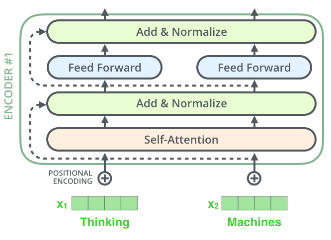


This is applied throughout the full encoder-decoder stack:


### Why residuals?
- Prevent **vanishing gradients** in deep networks
- Allow gradients to flow directly through the network
- The "highway" for information

### Why Layer Norm (not Batch Norm)?
- Batch Norm depends on batch statistics → problematic for variable-length sequences
- Layer Norm normalizes across the feature dimension for each token independently
- Works well at inference time even with batch_size=1

---

## 11. Output: Linear + Softmax

After the final decoder layer, a **linear projection** maps to vocabulary logits, followed by **softmax** to get probabilities:

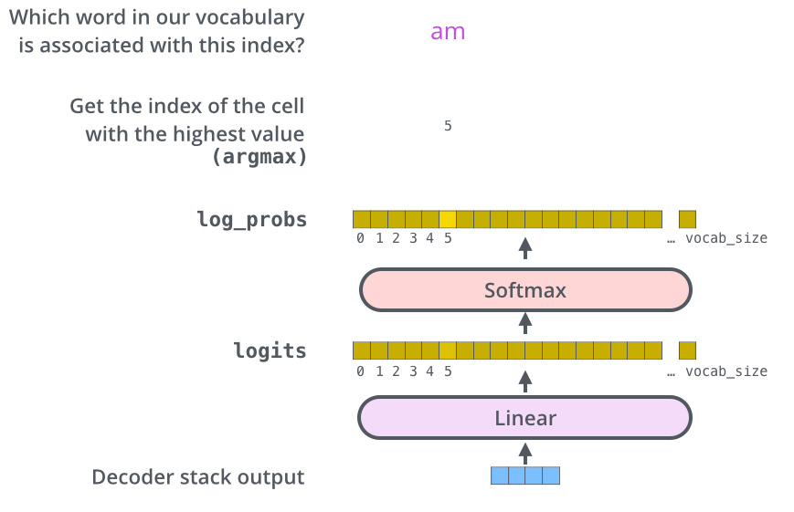

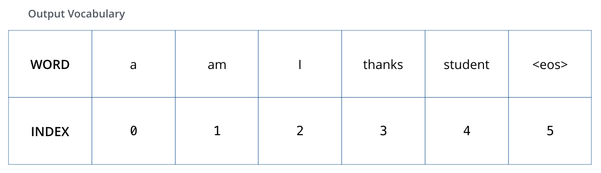

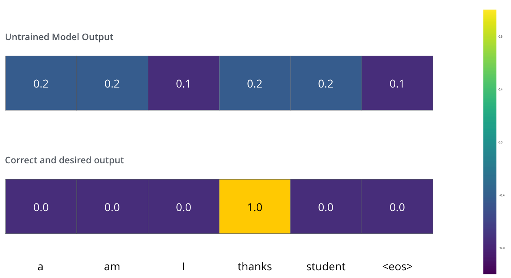

```python
class OutputProjection(nn.Module):
    def __init__(self, d_model, vocab_size):
        super().__init__()
        self.proj = nn.Linear(d_model, vocab_size)

    def forward(self, x):
        return F.log_softmax(self.proj(x), dim=-1)
```

The final token is selected via **greedy decoding**, **beam search**, or **sampling**.

### Probability Distribution Visualization

During training, the target distribution is one-hot. The model learns to produce:

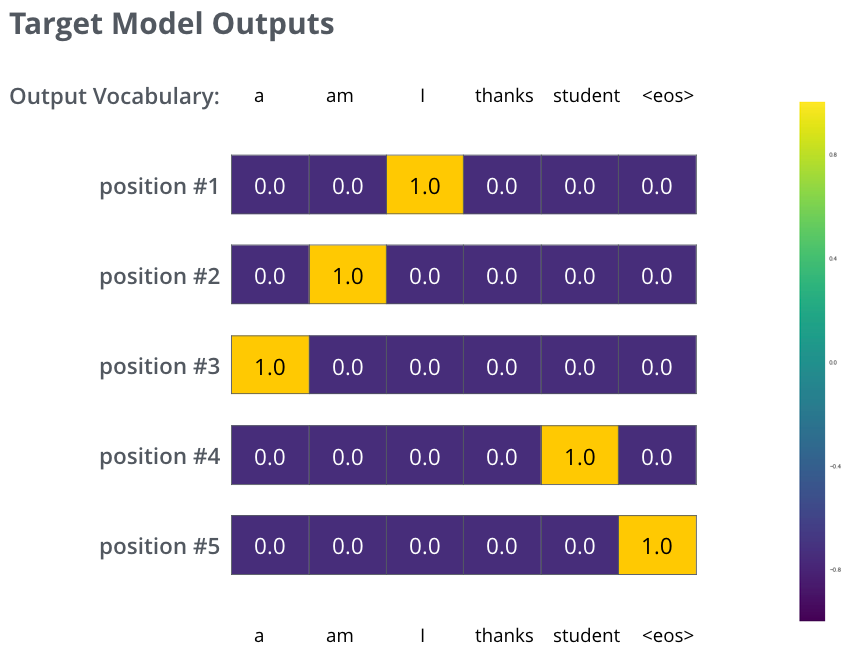

After training, the model's output closely matches the targets:

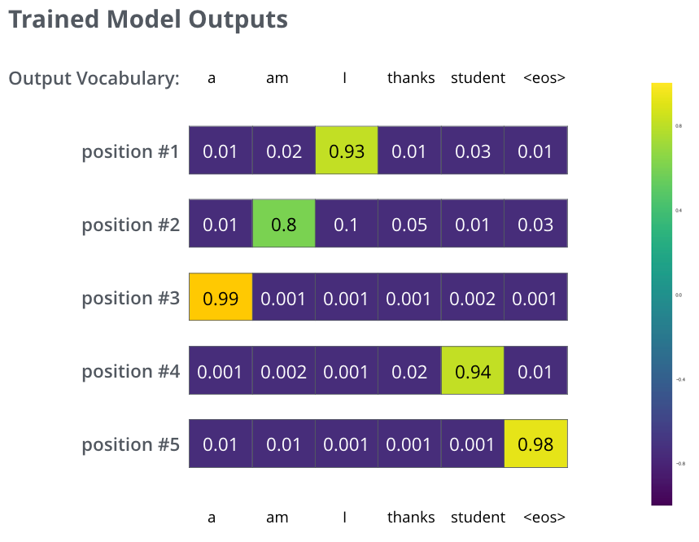

---

## 12. Training & Loss

### Label Smoothing

Instead of a hard one-hot target, the paper uses **label smoothing** (ε = 0.1):

$$y_{smooth} = (1 - \varepsilon) \cdot y_{onehot} + \frac{\varepsilon}{V}$$

This prevents overconfidence and improves generalization.

### Loss Function

**Cross-entropy** over the vocabulary at each position:

$$\mathcal{L} = -\sum_{t=1}^{T} \log P(y_t \mid y_{<t}, x)$$

### Optimizer: Adam with Warmup

The paper uses a custom learning rate schedule:

$$lr = d_{model}^{-0.5} \cdot \min(\text{step}^{-0.5},\; \text{step} \cdot \text{warmup\_steps}^{-1.5})$$

- **Warm up** for the first `warmup_steps` (4000) steps
- Then decay proportional to `step^{-0.5}`

```python
def get_lr(step, d_model=512, warmup_steps=4000):
    step = max(step, 1)
    scale = d_model ** -0.5
    return scale * min(step ** -0.5, step * warmup_steps ** -1.5)
```

### Dropout

Applied to:
- Attention weights
- FFN activations
- Input embeddings + positional encodings

Rate = 0.1 in the base model.

---

## 13. Complexity & Parallelism

| Layer Type | Complexity per Layer | Sequential Operations | Max Path Length |
|---|---|---|---|
| Self-Attention | O(n² · d) | O(1) | O(1) |
| Recurrent | O(n · d²) | O(n) | O(n) |
| Convolutional | O(k · n · d²) | O(1) | O(log_k(n)) |

**Self-Attention is O(1) in sequential steps** — fully parallelizable!  
The **O(n²)** memory cost is the main bottleneck for very long sequences.

> For typical NLP sequences (n ≪ d), self-attention is faster than recurrent layers.

### Efficient Attention Variants

For long sequences (n >> 512), several approximations exist:
- **Sparse Attention** (OpenAI, 2019) — attend to a subset of positions
- **Longformer** — local + global attention windows
- **Linformer** — low-rank approximation, O(n) memory
- **FlashAttention** — IO-aware exact attention, much faster in practice

---

## 14. Variants & Modern Descendants

```
Transformer (2017)
│
├── Encoder-only
│   ├── BERT (2018) — Bidirectional, masked LM pretraining
│   ├── RoBERTa (2019) — Improved BERT training
│   └── DistilBERT — Smaller, faster BERT
│
├── Decoder-only
│   ├── GPT (2018) — Autoregressive language model
│   ├── GPT-2 / GPT-3 — Scaled up
│   └── LLaMA / Mistral — Open-source LLMs
│
└── Encoder-Decoder
    ├── T5 (2019) — "Text-to-Text Transfer"
    ├── BART (2019) — Denoising autoencoder
    └── mT5 — Multilingual T5
```

### Key Architectural Evolutions

| Model | Change from Original |
|---|---|
| BERT | Encoder-only, bidirectional, MLM + NSP pretraining |
| GPT | Decoder-only, causal LM, scaled parameters |
| T5 | Encoder-decoder, all tasks as text-to-text |
| ViT | Patches of images as tokens (Vision Transformer) |
| GPT-3 / GPT-4 | Massive scale (175B+ params), few-shot learning |

---

## 15. Summary Cheat-Sheet

### Architecture Parameters (Original Paper)

| Hyperparameter | Base Model | Big Model |
|---|---|---|
| `d_model` (embedding dim) | 512 | 1024 |
| `N` (encoder/decoder layers) | 6 | 6 |
| `h` (attention heads) | 8 | 16 |
| `d_k = d_v` | 64 | 64 |
| `d_ff` (FFN inner dim) | 2048 | 4096 |
| Dropout | 0.1 | 0.3 |
| Parameters | 65M | 213M |

### Data Flow Summary

```
Input Tokens
    │
    ▼
Token Embeddings × √d_model
    │
    + Positional Encoding
    │
    ▼
┌─────────────────────────────┐
│         Encoder × N         │
│  ┌──────────────────────┐   │
│  │ Multi-Head Self-Attn │   │
│  └──────────┬───────────┘   │
│         Add & Norm          │
│  ┌──────────────────────┐   │
│  │  Feed-Forward (FFN)  │   │
│  └──────────┬───────────┘   │
│         Add & Norm          │
└─────────────────────────────┘
    │
    ▼ (encoder memory K, V)
┌─────────────────────────────┐
│         Decoder × N         │
│  ┌──────────────────────┐   │
│  │ Masked Self-Attn     │   │  ← causal mask
│  └──────────┬───────────┘   │
│         Add & Norm          │
│  ┌──────────────────────┐   │
│  │ Cross-Attention      │   │  ← Q from decoder, K/V from encoder
│  └──────────┬───────────┘   │
│         Add & Norm          │
│  ┌──────────────────────┐   │
│  │  Feed-Forward (FFN)  │   │
│  └──────────┬───────────┘   │
│         Add & Norm          │
└─────────────────────────────┘
    │
    ▼
Linear Projection → Vocab logits
    │
    ▼
Softmax → Token Probabilities
```

### Key Equations

| Component | Formula |
|---|---|
| Scaled Dot-Product | $\text{softmax}\!\left(\frac{QK^T}{\sqrt{d_k}}\right)V$ |
| Multi-Head | $\text{Concat}(\text{head}_1,\ldots,\text{head}_h)W^O$ |
| FFN | $\max(0, xW_1+b_1)W_2+b_2$ |
| Layer Norm | $\frac{x-\mu}{\sigma+\varepsilon}\cdot\gamma+\beta$ |
| Positional Enc (even) | $\sin(pos / 10000^{2i/d_{model}})$ |
| Positional Enc (odd) | $\cos(pos / 10000^{2i/d_{model}})$ |

---

## References

- Vaswani et al. (2017) — [Attention Is All You Need](https://arxiv.org/abs/1706.03762)
- Jay Alammar — [The Illustrated Transformer](https://jalammar.github.io/illustrated-transformer/) *(all diagrams in this document)*
- Harvard NLP — [The Annotated Transformer](http://nlp.seas.harvard.edu/2018/04/03/attention.html)
- Lilian Weng — [Attention? Attention!](https://lilianweng.github.io/posts/2018-06-24-attention/)
